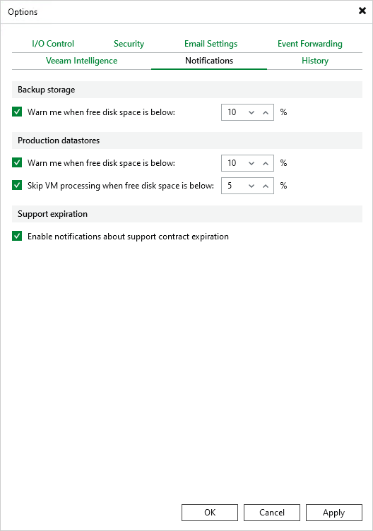

# Configuring Notification Settings

You can enable notifications for Veeam Backup & Replication events that may require your actions:

1. From the main menu of the Veeam Backup & Replication console, select Options.
2. Switch to the Notifications tab.
3. In the Backup storage section, choose whether you want to receive notifications when backup repositories used as target locations for VM backups start running out of free space. While processing VMs included into backup jobs, Veeam Backup & Replication analyzes the amount of storage space left in target repositories and displays warnings in [job session details](session_results.md) if a specific threshold is breached.
4. In the Production datastores section choose whether you want to receive notifications when Veeam Backup & Replication storage disks used as target locations for VM snapshots start running out of free space. While processing VMs included into backup jobs, Veeam Backup & Replication analyzes the amount of space left on target storage disks and displays warnings in [job session details](session_results.md) if a specific threshold is breached.

|  |
| --- |
| Important |
| Due to technical limitations, Veeam Backup & Replication does not apply notification settings configured in the Production datastore section to backup jobs that process oVirt VMs. |

1. In the Support expiration section, choose whether you want to receive notifications when the Production Support and Maintenance agreement included into your Subscription license is about to expire. When Veeam Backup & Replication detects that there are less than 14 days left before the support expiration date, it sends an email notification to the recipient specified in the [general email settings](ovirt_email_settings.md).

For more information on how to track the support expiration date, see section [Viewing License Information](view_license_console.md).

