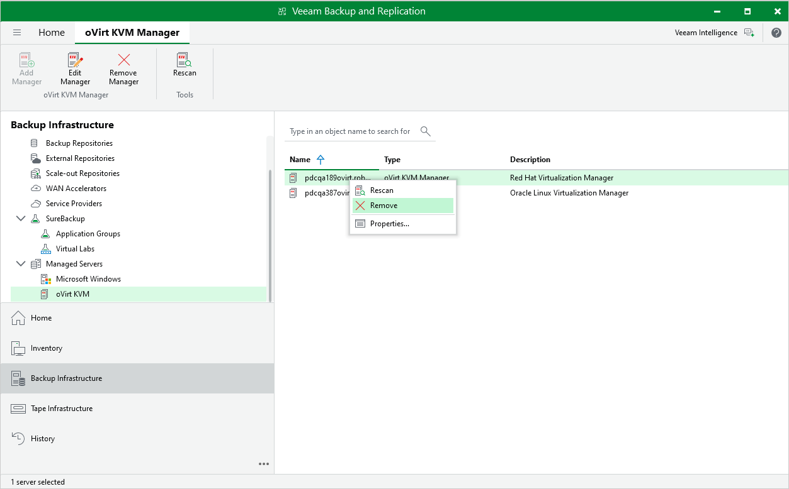

# Removing oVirt KVM Manager

If you do not want to protect resources managed by the connected oVirt KVM Manager anymore, you can remove it from the backup infrastructure. To do that:

1. Open the Backup Infrastructure view.
2. In the inventory pane, select Managed Servers > oVirt KVM.
3. In the working area, select the oVirt KVM Manager and click Remove Manager on the ribbon.

Alternatively, right-click the oVirt KVM Manager and select Remove.

