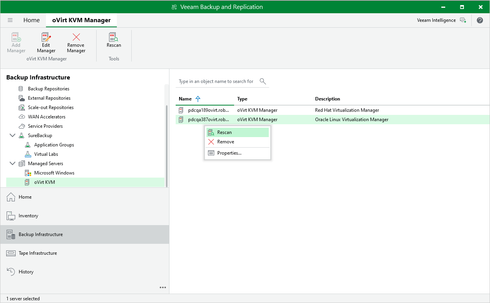

# Rescanning oVirt KVM Manager

Veeam Plug-in for oVirt KVM retrieves information about the oVirt KVM environment from the oVirt KVM Manager. However, the data synchronization process may take some time to complete. If you make any changes to the oVirt KVM environment and want the Veeam Backup & Replication console to display the changes immediately, you can rescan the oVirt KVM Manager manually.

To rescan the oVirt KVM Manager, do the following:

1. Open the Backup Infrastructure view.
2. In the inventory pane, select Managed Servers > oVirt KVM.
3. In the working area, select the oVirt KVM Manager and click Rescan on the ribbon.

Alternatively, right-click the oVirt KVM Manager and select Rescan.

