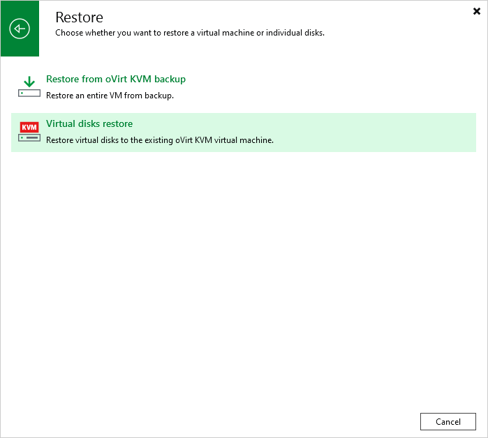

# Step 1. Launch Virtual Disk Restore Wizard

To launch the Virtual Disk Restore wizard, do the following:

1. In the Veeam Backup & Replication console, open the Home view.
2. In the inventory pane, select Jobs > Backup.
3. On the ribbon, click Restore >  oVirt KVM.
4. Click Entire machine restore.
5. Click Restore to oVirt KVM.
6. Click Virtual disks restore.

|  |
| --- |
| Tip |
| Alternatively, you can expand the necessary backup in the working area, right-click the VM and select Restore virtual disks to oVirt KVM. |

