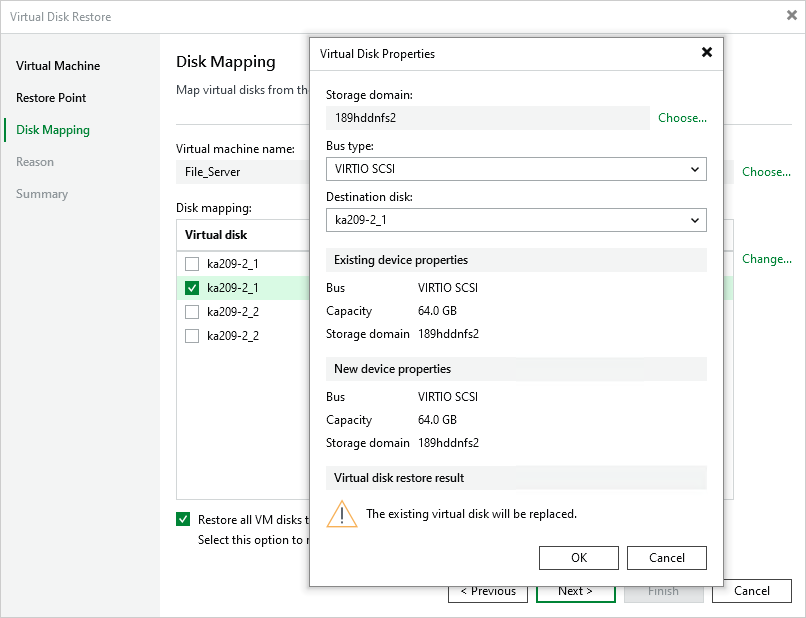

# Step 4. Configure Mapping Settings

At the Disk Mapping step of the wizard, do the following:

1. Choose a target VM to which you want to attach the restored disks.

By default, Veeam Backup & Replication attaches the restored disks to the original VM. To attach the disks to another VM, click Choose.

|  |
| --- |
| Important |
| During disk restore, Veeam Backup & Replication turns off the target VM to reconfigure its settings and attach the restored disks. It is recommended that you stop all activities on the target VM till the restore session completes. |

1. Select virtual disks to restore.

By default, Veeam Backup & Replication attaches the restored disks to the target VM as new disks. If you want the restored disks to replace the existing disks, or if you want to change the disk bus type and to specify a storage domain for the restored disks, click Change.

|  |
| --- |
| Tip |
| You can instruct Veeam Plug-in for oVirt KVM to restore the disks in the QCOW2 format. This will [increase speed and efficiency of incremental backups](ovirt_changed_block_tracking.md) further created for the VM. |

