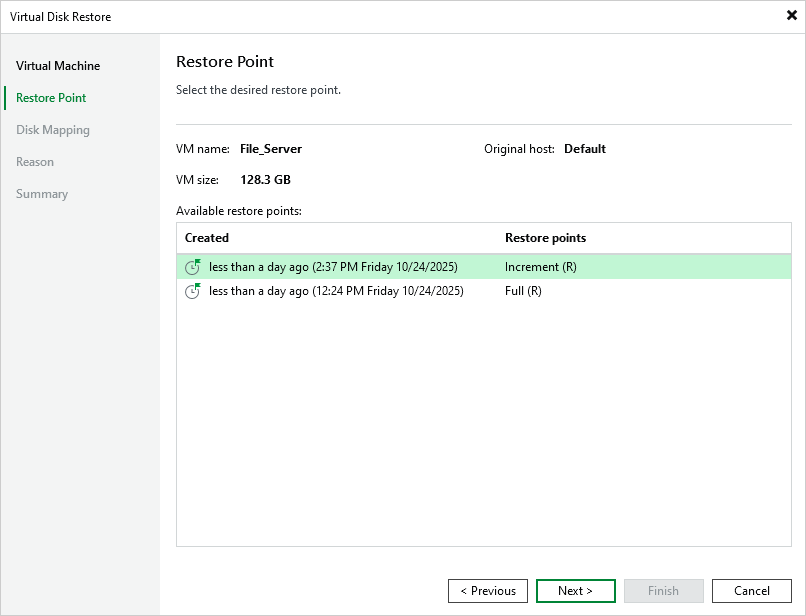

# Step 3. Select Restore Point

At the Restore Point step of the wizard, select a restore point that will be used to restore data. By default, Veeam Backup & Replication uses the most recent valid restore point. However, you can restore the data to an earlier state.

