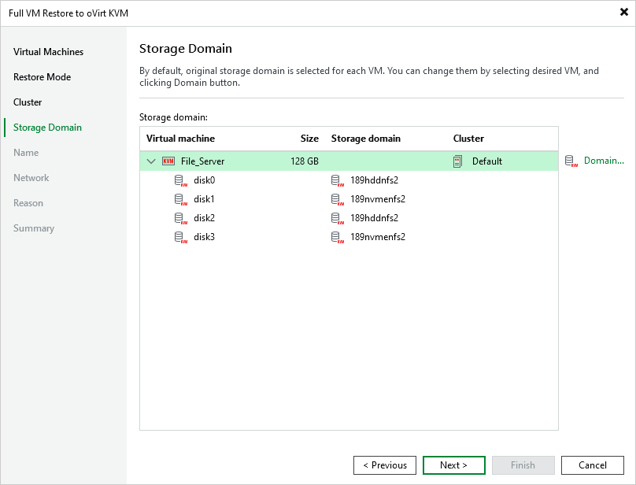

# Step 5. Select Storage Domain

[This step applies only if you have selected the Restore to a new location, or with different settings option at the Restore Mode step of the wizard]

At the Storage Domain step of the wizard, choose the storage domain where virtual disks of the recovered VM will be stored.

For a domain to be displayed in the list of the available domains, it must be configured in the virtual environment as described in [Red Hat Virtualization documentation](https://access.redhat.com/documentation/en-us/red_hat_virtualization/4.4/html/administration_guide/chap-storage#Understanding_Storage) or [Oracle Linux Virtualization Manager documentation](https://docs.oracle.com/en/virtualization/oracle-linux-virtualization-manager/admin/admin-admin-tasks.html#storage-tasks).

