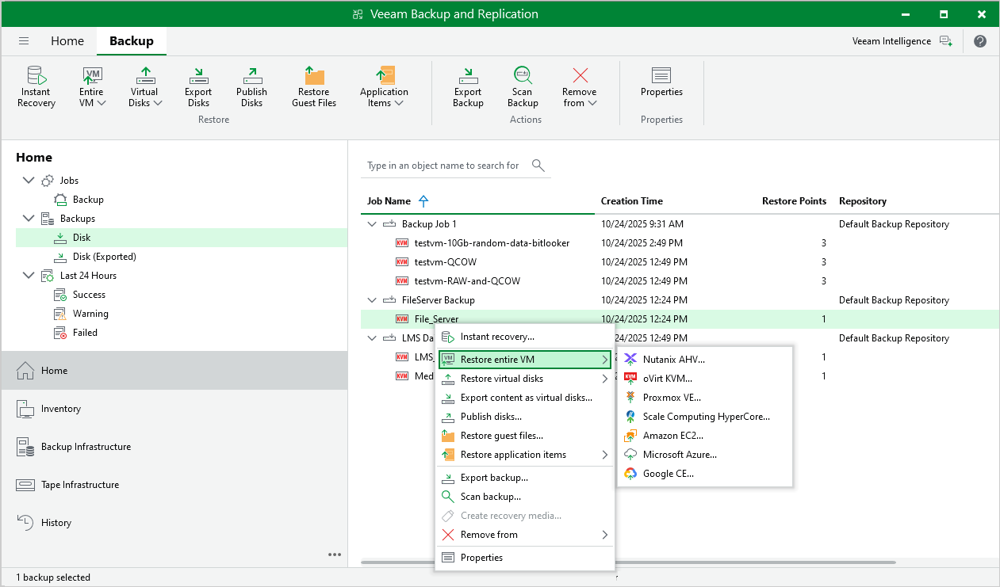

# Step 1. Launch Full VM Restore to oVirt KVM Wizard

To launch the Full VM Restore to oVirt KVM wizard, do the following:

1. In the Veeam Backup & Replication console, open the Home view.
2. In the inventory pane, select Backups.

1. In the working area, expand the necessary backup, select the VM that you want to restore and click Entire VM > oVirt KVM on the ribbon.

Alternatively, right-click the VM and select Restore entire VM > oVirt KVM.

