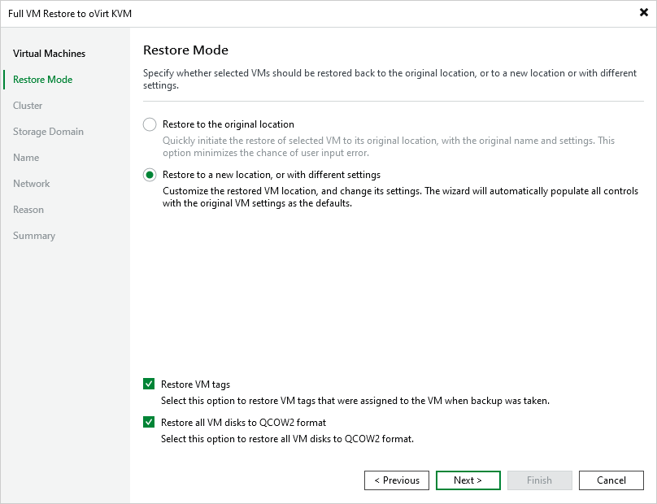

# Step 3. Choose Restore Mode

At the Restore Mode step of the wizard, choose whether you want to restore the selected VM to the original or to a custom location. You can also choose whether you want the recovered VM to have the same tags as the original VM.

|  |
| --- |
| Tip |
| You can instruct Veeam Plug-in for oVirt KVM to restore disks attached to the recovered VM in the QCOW2 format. This will [increase speed and efficiency of incremental backups](ovirt_changed_block_tracking.md) further created for the VM. |

