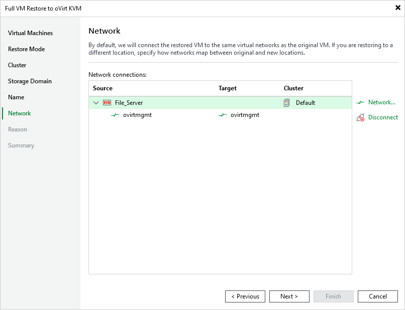

# Step 7. Configure Network Settings

[This step applies only if you have selected the Restore to a new location, or with different settings option at the Restore Mode step of the wizard]

At the Network step of the wizard, choose a network to which the recovered VM will be connected. If you do not want to connect the VM to any virtual network, select the VM and click Disconnect.

For a network to be displayed in the list of the available networks, it must be configured in the virtual environment as described in [Red Hat Virtualization documentation](https://access.redhat.com/documentation/en-us/red_hat_virtualization/4.4/html/administration_guide/chap-logical_networks#Performing_Networking_Tasks) or [Oracle Linux Virtualization Manager documentation](https://docs.oracle.com/en/virtualization/oracle-linux-virtualization-manager/admin/admin-admin-tasks.html#admin-networks).

