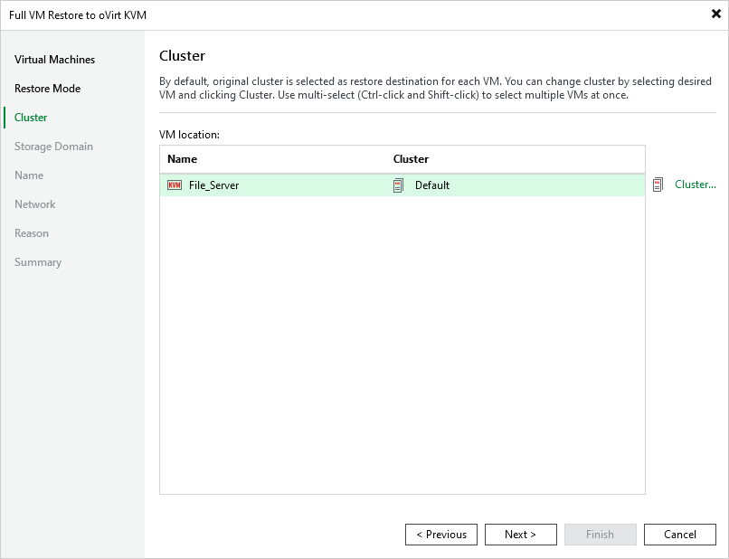

# Step 4. Specify Target Cluster

[This step applies only if you have selected the Restore to a new location, or with different settings option at the Restore Mode step of the wizard]

At the Cluster step of the wizard, choose the cluster to which the recovered VM will belong.

For a cluster to be displayed in the list of the available clusters, it must be added to the virtual environment as described in [Red Hat Virtualization documentation](https://access.redhat.com/documentation/en-us/red_hat_virtualization/4.4/html/administration_guide/chap-clusters#doc-wrapper) or [Oracle Linux Virtualization Manager documentation](https://docs.oracle.com/en/virtualization/oracle-linux-virtualization-manager/admin/admin-admin-tasks.html#cluster-tasks).

