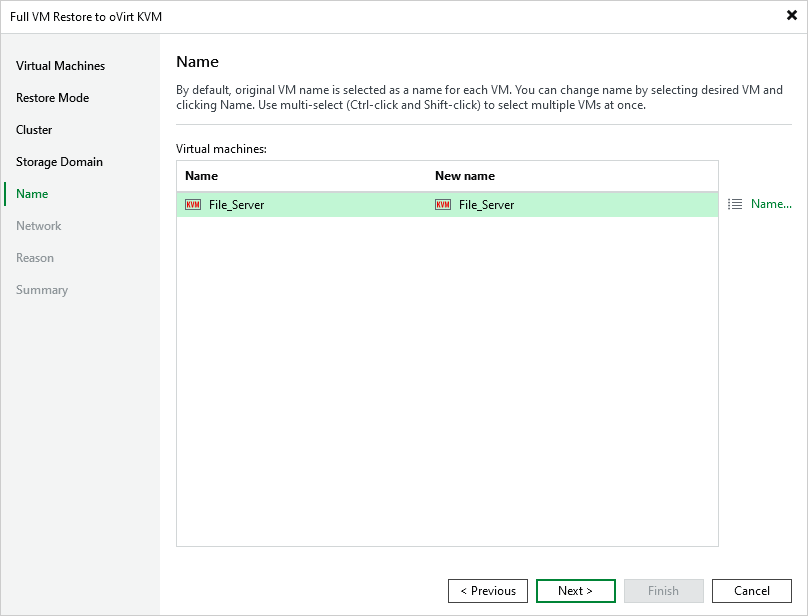

# Step 6. Specify VM Name

[This step applies only if you have selected the Restore to a new location, or with different settings option at the Restore Mode step of the wizard]

At the Name step of the wizard, you can specify a new name for the recovered VM. The maximum length of the name is 63 characters; the following characters are only supported: a-z, A-Z, 0-9, -. The hyphen-minus character (-) is supported, but you cannot use it as the first or the last character of the name.

