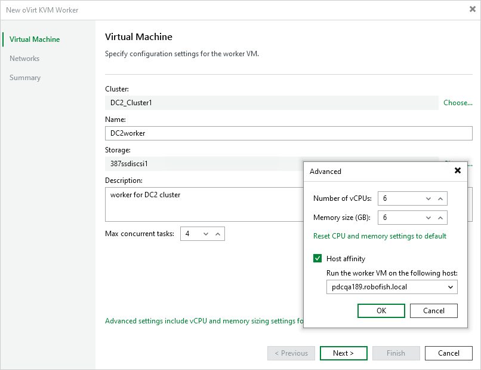

# Step 2. Specify Worker VM Settings

At the Virtual Machine step of the wizard, do the following:

1. Click Choose next to the Cluster field, and specify a cluster where the worker will be launched in the Select Cluster window. If you select the whole cluster, Veeam Plug-in for oVirt KVM will automatically define the host to launch the worker.

For a cluster to be displayed in the list of the available clusters, it must be added to the virtual environment as described in [Red Hat Virtualization documentation](https://access.redhat.com/documentation/en-us/red_hat_virtualization/4.4/html/administration_guide/chap-clusters#doc-wrapper) or [Oracle Linux Virtualization Manager documentation](https://docs.oracle.com/en/virtualization/oracle-linux-virtualization-manager/admin/admin-cluster-tasks.html).

1. In the Name field, specify a name for the worker.

The maximum length of the name is 40 characters; the following characters are only supported: a-z, A-Z, 0-9, -.

1. Click Choose next to the Storage Domain field, and specify a storage domain where worker system files will be stored in the Select Storage Domain window.

For a domain to be displayed in the list of the available domains, it must be configured in the virtual environment as described in [Red Hat Virtualization documentation](https://access.redhat.com/documentation/en-us/red_hat_virtualization/4.4/html/administration_guide/chap-storage#Understanding_Storage) or [Oracle Linux Virtualization Manager documentation](https://docs.oracle.com/en/virtualization/oracle-linux-virtualization-manager/admin/admin-storage-tasks.html).

1. In the Worker description field, provide a description for future reference. The field already contains a default description with information about the user who added the worker, date and time when the worker was added.

The maximum length of the description is 1024 characters.

1. In the Max concurrent tasks field, specify the number of tasks that the worker will be able to handle in parallel. If this value is exceeded, the worker will not start processing a new task until one of the currently running tasks finishes.

The default number of concurrent tasks is set to 4. When you change this value, the wizard automatically adjusts the amount of resources that will be allocated to the worker VM. If you want to specify the amount of resources manually, click Advanced settings.

|  |
| --- |
| Note |
| When performing data protection and disaster recovery operations, Veeam Plug-in for oVirt KVM initiates a new task for each VM that is being processed. |

1. To specify a host where the worker will be launched, click Advanced settings, select the Host affinity check box and choose the host.

If you do not specify host affinity settings, Veeam Backup & Replication will automatically define the host to launch the worker.

