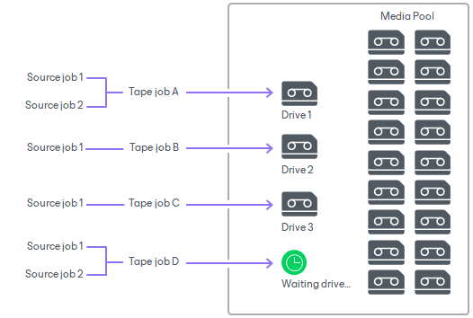
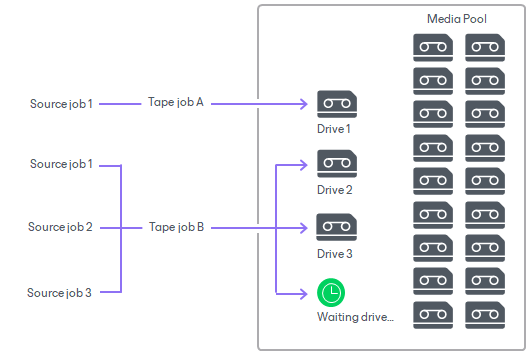
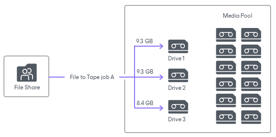

# Tape Parallel Processing

You can use multiple drives simultaneously for writing data to tape. This option is useful if you have a lot of tape jobs running at the same time or you have a lot of data that must be written to tape in a limited backup window. You can configure multiple drives in the following ways:

* Use multiple drives of one tape library.
* Manage multiple tape libraries and use several or all drives across all managed libraries.

Parallel processing is configured in [optional media pool settings](add_media_pool_encryption.md). To use drives of multiple libraries, you must [enable the parallel processing mode](add_media_pool_tapes.md) for the libraries that are managed by the media pool.

To process the tape data in parallel, you can split the data across drives in two ways:

* [Parallel processing for tape jobs](parallel_processing.md#1).
* [Parallel processing for source chains of one (or more) tape jobs](parallel_processing.md#2).

Tape jobs may simultaneously use less drives than configured in the media pool settings. That may happen under one of the following conditions:

* The number of tapes available is less than the number of drives assigned for this media pool.
* The number of drives available is less than the number of drives assigned for this media pool.

Processing Tape Jobs Simultaneously

When you process tape jobs in parallel, the media pool assigns a drive to each running tape job. For example, if you set three drives as the maximum, you can process up to three tape jobs at the same time. If you have more jobs running at the same time, they are queued. When one of the jobs finishes and releases its drive, the first queued job takes the drive.

To enable this mode, limit the number of drives the job can use, as described in section [Specify Archiving Options](backup_to_tape_options.md).

This option is available for backup to tape, file to tape and object to tape jobs.

For example:

* You set the maximum number of drives to three.
* Four tape jobs start at the same time.

The tape jobs start, and jobs A, B and C occupy three drives to write data to tape. Tape job D is queued and waits. When one of the jobs finishes and releases its drive, tape job D takes the drive and starts writing data.

Processing Independent Data Sources Simultaneously

When you select processing independent data sources in parallel, multiple drives can process multiple source backup chains or files simultaneously.

To enable this mode, select the Process independent data sources simultaneously check box in [optional media pool settings](add_media_pool_encryption.md).

This option is available for backup to tape jobs with per-machine backup files, backup to tape for unstructured data backups and file to tape jobs.

Example 1. Processing Two Tape Jobs with Multiple Source Jobs

* You set the maximum number of drives to three.
* Tape job A has one source job; tape job B has three source jobs. Both tape jobs start at the same time.

Tape job A occupies drive 1. Tape job B occupies two other available drives and processes two source jobs. Tape job A finishes and releases drive 1, the third source job from tape job B occupies drive 1.

If a source job produces multiple per-machine backups, the media pool processes several per-machine backup chains simultaneously. For more information about per-machine backup files, see [Backup Chain Formats](per_vm_backup_files.md).

Example 2. Processing One Tape Job with One Source Job for Four VMs

* You set the maximum number of drives to three.
* Tape job A has one source job, the source job processes four VMs.

Tape job A starts and occupies all three available drives. It writes each separate VM of the source job by a separate drive. After tape job A finishes writing one of the current VMs and releases one of the three available drives, it occupies this drive with writing VM4. In other words, if a job with per-machine chains is configured to process more VMs than there are drives available, it occupies the entire media pool.

The order in which VMs are queued for processing is defined by the order of VMs within each source job, by the order of source jobs within each tape job and the schedule configured for running tape jobs.

Similarly, if the source job is an agent job with the configured backup policy (the Managed by agent option is selected) and produces backups for multiple machines/protection groups, the media pool processes backups for several computers simultaneously. For more information about agent backup jobs, see [Working with Veeam Agent Backup Jobs and Policies](https://helpcenter.veeam.com/docs/vbr/userguide/backup_job_tasks.html).

Example 3. Processing One File to Tape Job

For backup to tape for unstructured data backups and file to tape jobs, Veeam Backup & Replication divides the data into backup sets, each to be written by a separate drive.

The size of the backup set is determined by either one of the following conditions:

* Maximum size of data is 9.3 GB.
* Maximum number of objects is 1,000,000 (includes objects to be backed up, objects deleted from disk and folders that require a version update).
* Maximum number of enumeration blocks is 50,000 (an enumeration block is one folder with its first level subfolders).

In the example, the following settings apply:

* You set the maximum number of drives to three.
* File to Tape job A has 50,000 files to process, the total size of data is 27 GB.

File to Tape job A starts and occupies all three available drives. Veeam Backup & Replication divides the data into three backup sets based on their size: drive 1 and drive 2 write 9.3 GB each, while drive 3 writes the remaining 8.4 GB of data to tape.

Related Topics

[Media Sets Created with Parallel Processing](parallel_processing_media_sets.md)

