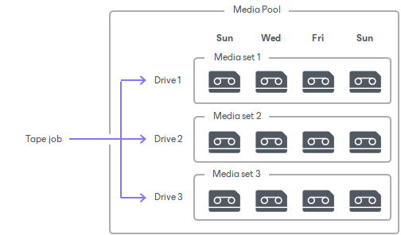
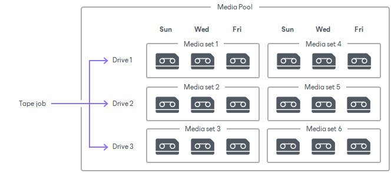

# Media Sets Created with Parallel Processing

In this article

With parallel processing, a separate media set is opened per each drive used.

|  |
| --- |
| Note |
| The media pool must have an available tape for each drive. |

The media sets are opened according to media set options configured for the media pool:

* [Parallel processing with Do not create, always continue using current media set option](#1)
* [Parallel processing with Create new media set for every backup session option](#2)
* [Parallel processing with Daily at option](#3)

You can edit the media pool settings at any time, and increase or reduce the maximum number of drives:

* If you reduce the number of drives, the media pool will use fewer drives for the next writing session. The media sets that become excessive will be closed.
* If you increase the number of drives, the media pool will open new media sets per each added drive. Further, the media pool will use these media sets according to the option you select for it.

|  |
| --- |
| Tip |
| When multiple media sets open simultaneously, they may have identical sequence number and time of creation. To distinguish between the media sets easily, use the %id% variable in the media set name. This variable is added to the media set name by default. |

Parallel Processing with Do Not Create, Always Continue Using Current Media Set Option

When the media pool is set to the Do not create, always continue using current media set option, a media set is opened per each drive during the first tape session. The next time a tape job starts, it chooses a tape that has most free space, and appends data to it.

For example, you set the maximum number of drives to 3. The tape jobs that are first to run start 3 media sets. The following tape sessions continue these 3 media sets appending data to them.

Parallel Processing with Create New Media Set for Every Backup Session Option

When the media pool is set to the Create new media set for every backup session option, a media set is opened per each drive for every writing session. When the jobs run the next time, they open several media sets anew.

Each media set uses a free tape. Note that this configuration is the most tape-consumptive.

Parallel Processing with Daily at Option

When the media pool is set to Daily at option, several media sets (per each drive) are opened on the scheduled day. If tape jobs run twice or more before the scheduled day, they continue these media sets — in this case, the jobs use tapes that have most free space first.

Page updated 11/16/2023

Page content applies to build 13.0.1.1071
