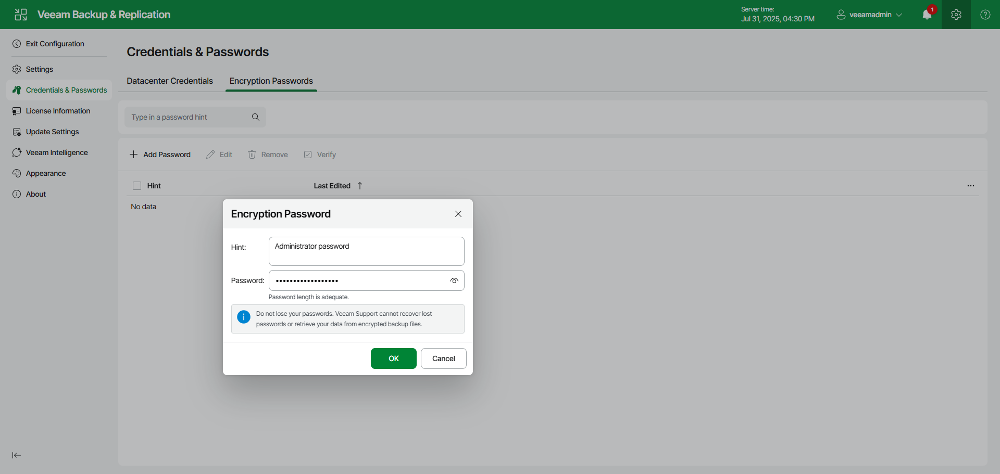

# Creating Passwords Using Web UI

In this article

To create a new password in the Password Manager, , do the following in the Veeam Backup & Replication web UI:

1. Click the gear icon in the top bar.
2. Select Credentials & Passwords in the management pane.
3. In the Encryption Passwords tab, click Add Password.
4. In the Hint field, specify a meaningful hint that will help you recall the password. The password hint is displayed when you import an encrypted file on the backup server and access this file.
5. In the Password field, enter a password. To create a strong password, follow the recommendations in the [How Backup Data Encryption Works](encryption_hiw.md) section.

To view the entered password, click and hold the eye icon on the right of the field.

1. Click OK.

|  |
| --- |
| Important |
| Always save a copy of the password you create in a secure place. If you lose the password, you will not be able to restore it. |

Page updated 11/19/2025

Page content applies to build 13.0.1.1071
