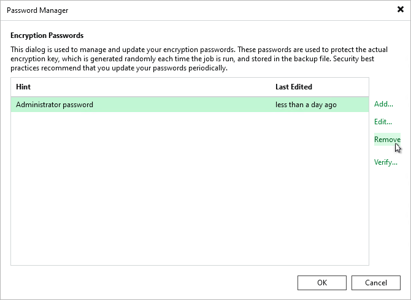

# Deleting Passwords

In this article

To delete a password in the Password Manager, perform the following steps:

1. Make sure that the password you want to delete is not used by any job on the backup server.
2. From the main menu, select Credentials & Passwords > Encryption Passwords.
3. Select the password and click Remove.

Page updated 7/28/2025

Page content applies to build 13.0.1.1071
