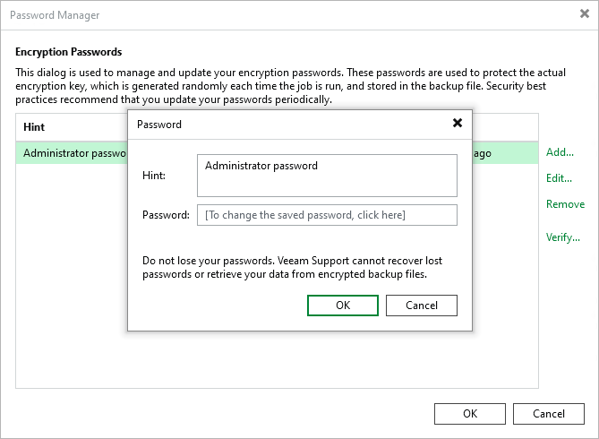

# Editing Passwords

To edit a password in the Password Manager, perform the following steps:

1. From the main menu, select Credentials & Passwords > Encryption Passwords.
2. Select the password and click Edit.
3. Update the hint or the password.
4. Click OK.

After you edit the password, you do not need to perform any other actions. Veeam Backup & Replication will start using the changed password after a job runs for the next time. Before the job run, the old password is still used. For more information on which password to use when you restore data, see [Restoring Data from Encrypted Backups](restore_encrypted.md).

