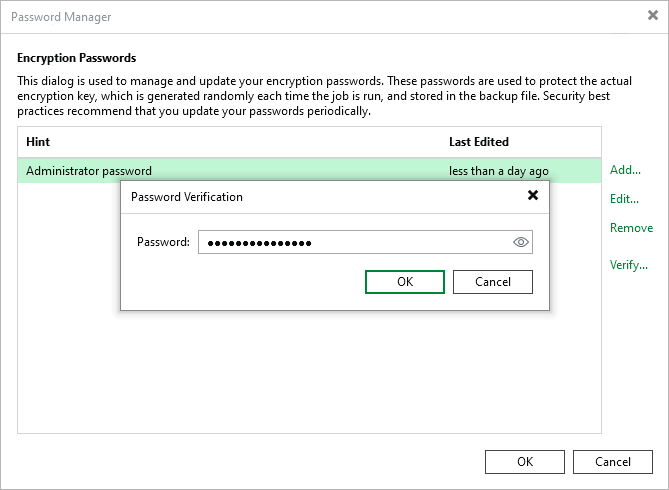

# Verifying Passwords

Veeam Backup & Replication allows you to verify encryption passwords created in the Password Manager. You can perform this operation periodically to make sure that you use a correct password.

To do this, perform the following steps:

1. From the main menu, select Credentials & Passwords > Encryption Passwords.
2. Select the password and click Verify.
3. Enter the password and click OK. If the passwords match, the verification is passed.

|  |
| --- |
| Note |
| Verification will be blocked for 5 minutes if there are 15 unsuccessful attempts in one minute. This mechanism reduces the risk of brute force attacks. |

