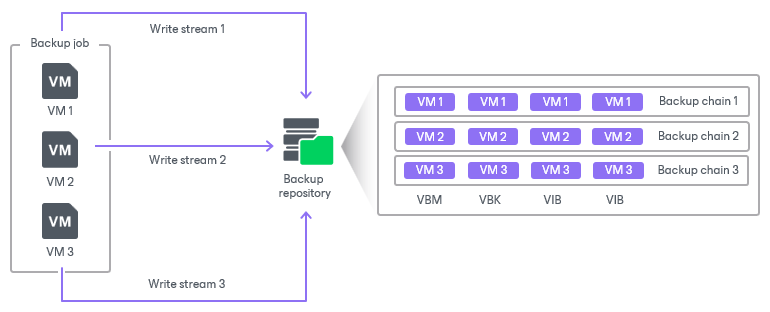
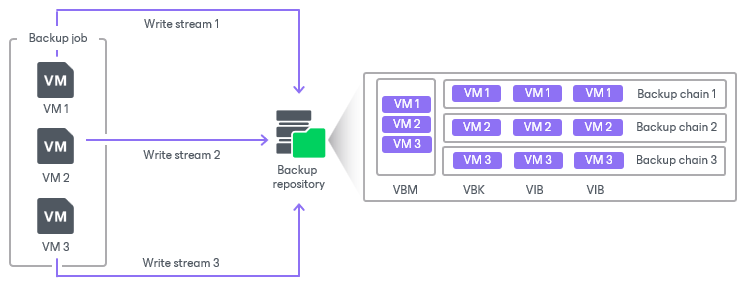
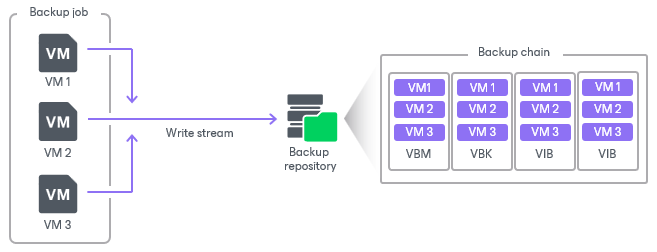

# Backup Chain Formats

When you add repositories to the backup infrastructure, you can configure how many backup files Veeam Backup & Replication creates for protected workloads. The type of backup files creted depends on the selected [backup method](backup_methods.md).

Veeam Backup & Replication provides the following backup chain formats:

* Per-machine backup with separate metadata files

Veeam Backup & Replication creates one metadata file for each workload in a job. During the job session, Veeam Backup & Replication creates one backup file for each workload. This approach allows you to manage individual workloads. For example, you can move backups to other jobs or create full backups.

* Per-machine backup with single metadata file (deprecated)

Veeam Backup & Replication creates one metadata file for all workloads in a job. During a job session, Veeam Backup & Replication creates one backup file for each workload.

* Single-file backup (deprecated)

Veeam Backup & Replication creates one metadata file for all workloads in a job. During a job session, Veeam Backup & Replication creates one backup file for all workloads.

The backup chain format depends on the version of Veeam Backup & Replication used when you added the backup repository. You can find the details further in this section.

|  |
| --- |
| Important |
| New backup copy jobs always create per-machine backup files with separate metadata files.  For backup copy jobs, consider the following:   * New backup copy jobs always create per-machine backup files with separate metadata files.  * Backup copy jobs created in the previous versions of Veeam Backup & Replication continue to create backups in the specified formats: single-file backups if the Use per-machine backup files option was disabled or per-machine backups with single metadata file if the option was enabled. You can upgrade the backup chain format as described in section [Upgrading Backup Chain Formats](backup_copy_change_type.md). |

Per-Machine Backup with Separate Metadata Files

When per-machine backup with separate metadata files format is used, a backup job writes data in a separate stream for each workload. Veeam Backup & Replication saves data of each workload into a separate backup file and also creates a separate metadata file (.VBM) for each workload. Veeam Backup & Replication perceives each backup created during one job session as one restore point. As a result, each workload has its own independent backup chain.

Such a way of storing backups is recommended and makes environment management more flexible. Veeam Backup & Replication can perform operations with individual workloads. It can, for example, move a workload and its backups from one job to another or launch active full backups for individual workloads.

When Veeam Backup & Replication needs to remove restore points by retention, it analyzes the backup chain of an individual workload, not all workloads. For more information on the restore point removal, see [Removal of Restore Points](retention_separate_vms.md).

Per-Machine Backup with Single Metadata File (Deprecated)

|  |
| --- |
| Important |
| In Veeam Backup & Replication versions prior to 12, you could enable the per-machine backup with single metadata file option in backup repositories. In Veeam Backup & Replication version 13, this backup format is deprecated and can no longer be selected. However, it is possible to restore, import and then [upgrade](backup_change_type.md#separate_meta_upgrade) such backup formats to per-machine backup with separate metadata files format. |

When per-machine backup with single metadata file format is used, a backup job writes data in a separate stream for each workload. Veeam Backup & Replication saves data of each workload into a separate backup file. However, Veeam Backup & Replication creates a single metadata file (.VBM) for all workloads and perceives all backups created during one job session as one restore point.

Such a way of storing backups is more efficient than a single-file backup format. Compared to per-machine backup with separate metadata files format, Veeam Backup & Replication cannot perform operations with individual workloads. These operations include moving backups, launching active full for individual workloads, and so on.

When Veeam Backup & Replication needs to remove earlier restore points by retention policy, it removes backup files of all workloads created during one job session. Veeam Backup & Replication does not remove data for separate workloads. In some situations, a certain workload can have fewer restore points than it is specified in retention policy settings. For more information on the restore point removal, see [Removal of Restore Points](retention_separate_vms.md).

Single-File Backup (Deprecated)

|  |
| --- |
| Important |
| In Veeam Backup & Replication versions prior to 13, you could enable the single-file backup option in backup repositories. In Veeam Backup & Replication version 13, this option is deprecated and can no longer be selected. However, a repository that was created prior to version 13 with the Single Storage setting enabled, will continue to work after upgrading to Veeam Backup & Replication 13. |

This is the default way of storing backup files for Veeam Backup & Replication prior to version 12. The single-file backups are created in backup repositories for which the Use per-machine backup files option is not selected.

When single-file backup format is used, a backup job writes workload data to a repository in one write stream. Veeam Backup & Replication saves data of all workloads into the same backup file and creates one metadata file (.VBM). Such behavior is not optimal if the target storage device is able to write data in multiple streams simultaneously. In this situation, the backup repository may become the bottleneck for the data transfer, even though its resources will not be fully utilized.

When Veeam Backup & Replication needs to remove earlier restore points by retention policy, it removes backup files of all workloads created during one job session. Veeam Backup & Replication does not remove data for separate workloads. In some situations, a certain workload can have fewer restore points than it is specified in retention policy settings. For more information on the restore point removal, see [Removal of Restore Points](retention_separate_vms.md).

Limitations and Considerations for Per-Machine Backup Files

When planning to use per-machine backup files, consider the following limitations:

* We recommend that you use the Use per-machine backup files option, especially for deduplicating storage appliances used as backup repositories. Veeam Backup & Replication will write machine data to the backup repository in several streams, which will improve the backup job performance. However, deduplication may be less effective compared to deduplication for single-file backups. Deduplication works within one backup file. For single-file backups, one backup file stores data for all machines, which is why data is deduplicated for all machines. Per-machine backups store data for one machine, which is why data is deduplicated for one machine only.
* [For Veeam Agent backup jobs] Veeam Backup & Replication ignores the Use per-machine backup files option. The way Veeam Backup & Replication creates backup files depends on the objects included in the backup job:

* If several Veeam Agent machines are included in the backup job, Veeam Backup & Replication creates a separate backup file for each machine.
* If failover clusters are included in the backup job, Veeam Backup & Replication creates a separate backup file for each cluster.

Upgrading Backup Chain Formats

Changing the Use per-machine backup files option for repositories does not affect the way backups are created. To change the backup chain format, see:

* [Upgrading Backup Chain Formats](backup_change_type.md) for backup jobs.
* [Upgrading Backup Chain Formats](backup_copy_change_type.md) for backup copy jobs.

Related Topics

* [Removal of Restore Points](retention_separate_vms.md)

* [Adding Microsoft Windows Repositories](repo_add.md)
* [Adding Scale-Out Backup Repositories](sobr_add.md)

