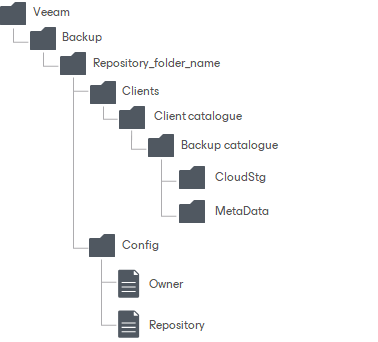

# Extent Structure of Performance Tier with Object Storage Repositories

If your performance tier consists of object storage repositories, Veeam Backup & Replication creates and maintains the following structure of directories after backups are moved to the performance tier extents.

| Directory | Description |
| --- | --- |
| Veeam/Backup/ | Standard folders created by Veeam Backup & Replication. |
| Repository\_folder\_name | Contains information on the repository name and the repository ID. |
| Clients | Contains backups. |
| Client catalogue | Contains information on solutions that create backups to this repository. |
| Backup catalogue | Contains backup ID. |
| CloudStg | Contains data blocks. |
| MetaData | Contains metadata. |
| Config | Contains information on the object storage repository infrastructure. |
| Owner | Contains information on a repository owner. |
| Repository | Contains information on a repository. |

