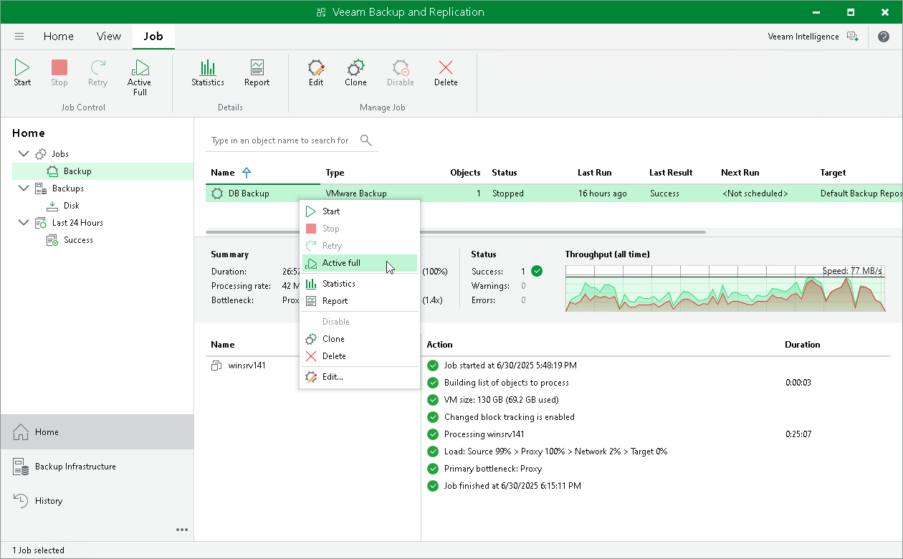
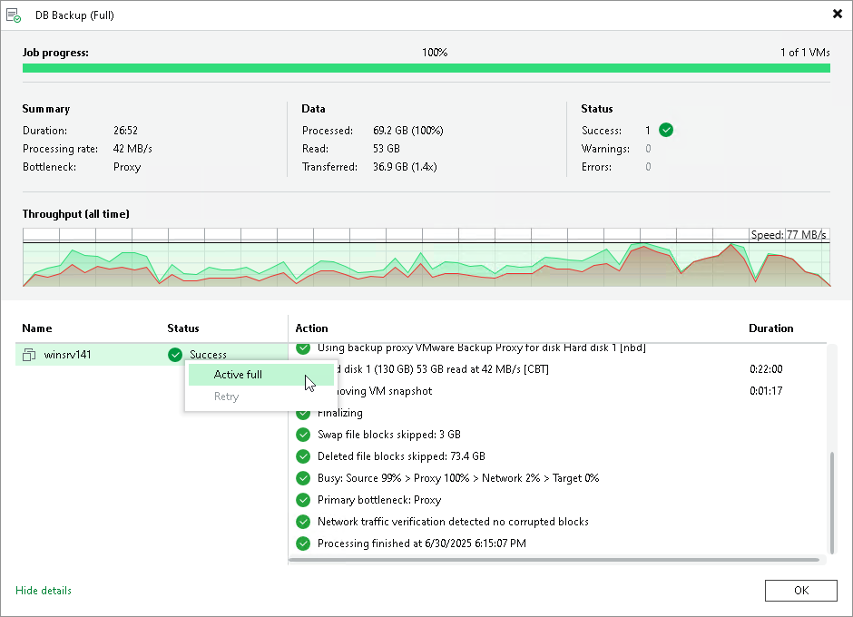

# Performing Active Full Backup Using Console

You can create an ad-hoc full backup — active full backup, and add it to the backup chain in the backup repository. The active full backup resets the backup chain. All subsequent incremental backups use the active full backup as a starting point. The previously used full backup will remain in the backup repository until it is removed from the backup chain according to the retention policy.

Performing Active Full Backup for All Workloads

To perform active full backup for all workloads in a backup job:

1. Open the Home view.
2. In the inventory pane, select Jobs.
3. In the working area, select the necessary job and click Active Full on the ribbon. Alternatively, you can right-click the job and select Active Full.

Performing Active Full Backup for Individual Workloads

To perform active full backup for individual workloads:

1. Open [real-time statistics](realtime_statistics_hv.md) or [sessions results](session_results_hv.md) of the job.
2. Select workloads for which you want to perform active full backup.
3. Right-click one of the selected workloads and click Active Full. Note that you will be able to launch active full backup for other workloads in the job only after active full finishes for the selected workloads.

|  |
| --- |
| Important |
| You can perform active full backup for individual workloads only if their backups are [per-machine with separate metadata files](per_vm_backup_files_hv.md). |

