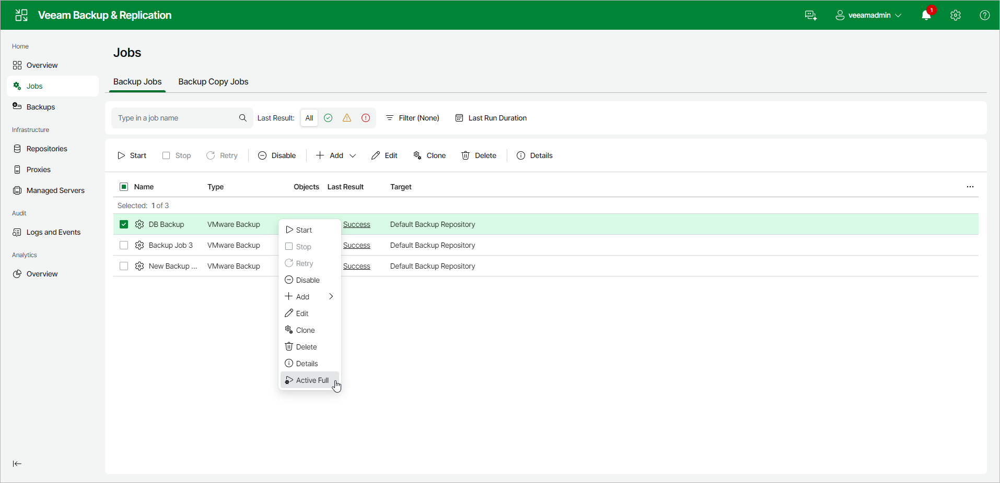

# Performing Active Full Backup Using Web UI

In this article

You can create an ad-hoc full backup — active full backup, and add it to the backup chain in the backup repository. The active full backup resets the backup chain. All subsequent incremental backups use the active full backup as a starting point. The previously used full backup will remain in the backup repository until it is removed from the backup chain according to the retention policy.

Performing Active Full Backup for All Workloads

To perform active full backup for all workloads in a backup job:

1. Open Jobs node in the management pane.
2. In the working area, right-click the necessary job and select Active Full.

Page updated 8/15/2025

Page content applies to build 13.0.1.1071
