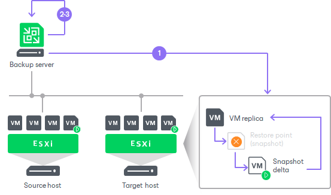

# Permanent Failover

In this article

Permanent failover is one of the ways to finalize failover. When you perform permanent failover, you permanently switch from the source VM to its replica. As a result of permanent failover, the VM replica stops acting as a replica and starts acting as the production VM.

The permanent failover operation is performed in the following way:

1. Veeam Backup & Replication removes snapshots (restore points) of the VM replica from the snapshot chain and deletes associated files from the datastore. Changes that were written to the snapshot delta file are committed to the VM replica disk files to bring the VM replica to the most recent state.
2. Veeam Backup & Replication removes the VM replica from the list of replicas in the Veeam Backup & Replication console.
3. To protect the VM replica from corruption after permanent failover is complete, Veeam Backup & Replication reconfigures the current replication job by adding the source VM to the list of exclusions. Note that other jobs are not modified automatically. When the replication job starts, the source VM is skipped from processing. As a result, no data is written to the working VM replica.

Related Topics

[Performing Permanent Failover](failover_permanent.md)

Page updated 3/19/2025

Page content applies to build 13.0.1.1071
