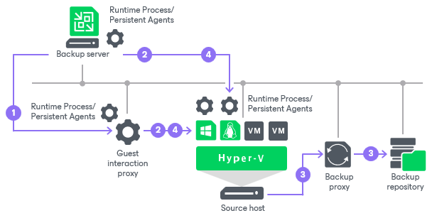
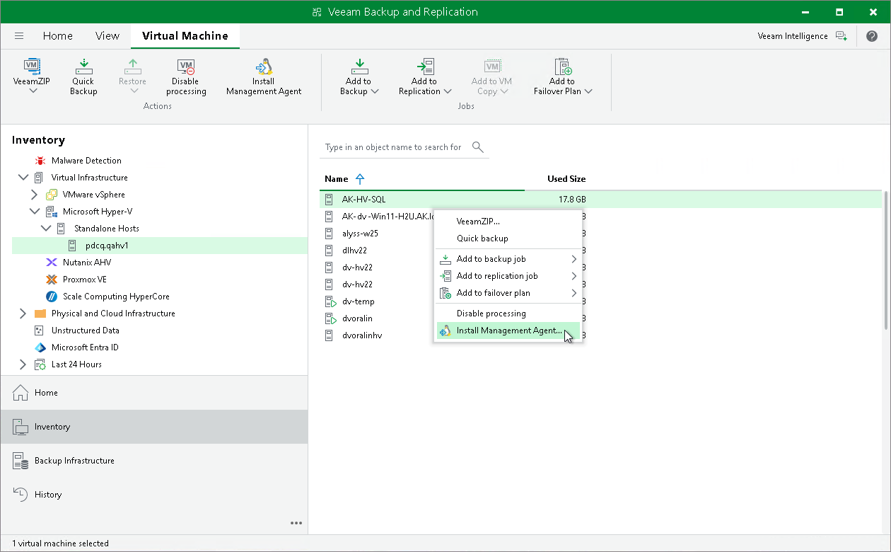
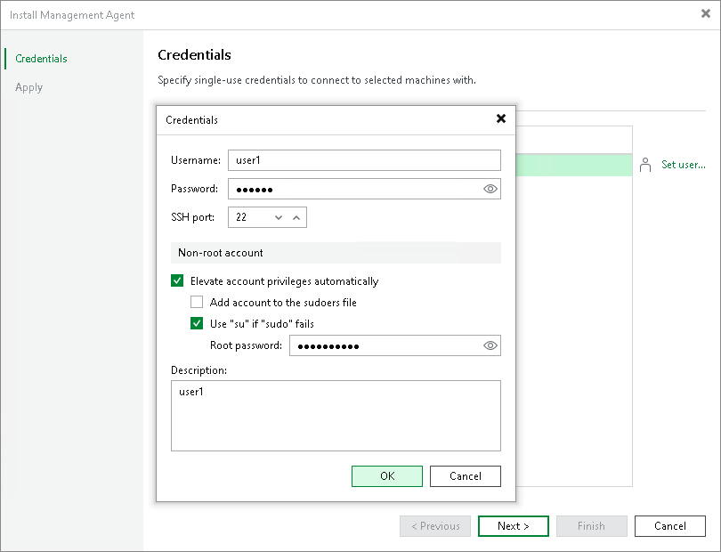

# Persistent Agent Components

In this article

If you want to perform guest processing in a highly secure way, you can use persistent agent components (Guest Helper, Log Shipping Service) on protected VMs. Persistent agent components require very limited and clearly defined ports to communicate with Veeam Backup & Replication. For more information about ports, see [Guest Processing Components](used_ports.md#guest_processing_components).

Prerequisites

To use persistent agent components, ensure the Deployment Kit is generated on a backup server and run on a protected Windows machine. The Deployment Kit typically contains necessary binaries and supporting files, authentication certificates, and a sample service configuration script (InstallDeploymentKit.BAT) for automated installation. For more information, see [Using Veeam Deployment Kit](deployment_kit.md).

Certificate Lifecycle

When you use the Deployment Kit to enable certificate-based authentication for persistent guest agents, certificates follow a defined lifecycle.

The Deployment Kit installs a temporary certificate on a protected VM to enable initial communication. By default, this certificate is valid for 30 days (720 hours). You can adjust the validity period only when you generate the kit using PowerShell or the backup server REST API. Only one temporary certificate is active at a time. Creating a new kit invalidates previously issued temporary certificates.

When you run a backup job with Application-Aware Processing and persistent guest agents enabled, Veeam Backup & Replication automatically replaces the temporary certificate with a permanent certificate. The permanent certificate remains valid for 10 years. This process transitions the environment from short-term to long-term security without manual intervention.

For information about the Deployment Kit generation and installation steps, see [Using Veeam Deployment Kit](deployment_kit.md).

Installing Persistent Agent Components on Microsoft Windows VMs

For Microsoft Windows VMs, Veeam Backup & Replication deploys persistent agent components using guest interaction proxies. For more information, see [Guest Interaction Proxies](guest_interaction_proxy.md). If there are no guest interaction proxies or guest interaction proxies fail for some reason, Veeam Backup & Replication will deploy persistent agent components on Microsoft Windows VMs from the backup server.

To use persistent agent components, select the Use persistent guest agent check box when specifying application-aware processing settings as described in section [Application-Aware Processing](backup_job_vss_application_hv.md) for VM backup jobs. The [Veeam Installer Service](installer_service.md) will install persistent guest agents during the first run of the backup job.

When you select the Use persistent guest agent option, Veeam Backup & Replication performs processing of the backup jobs with enabled guest processing according to the following algorithm.

When you start a job with guest processing tasks enabled, Veeam Backup & Replication performs the following operations:

1. Veeam Backup & Replication defines the machines that will perform the guest interaction proxy role.
2. The guest interaction proxy connects to VMs and deploys persistent agent components on them.

|  |
| --- |
| Note |
| If the account used for guest processing is a local (non-domain) account, the remote UAC may block the connection. It is a default security policy in Windows that prevents local user accounts from being used to remotely connect to a server. In this case, either use the local administrator account or disable the remote UAC to connect to the persistent agent. For more information, see [this Veeam KB article](https://www.veeam.com/kb4185). |

1. The job session proceeds as usual.

Veeam Backup & Replication performs operation 4 visible in the following schema only when [non-persistent runtime components](non_persistent_runtime_components_hv.md) are used.

If a network connection breaks during the job session, Veeam Backup & Replication makes attempts to re-establish the connection:

* If a network connection between the backup server/guest interaction proxy and VM guest OS breaks, Veeam Backup & Replication makes one attempt to reconnect.
* If a network connection between the backup server and guest interaction proxy breaks, Veeam Backup & Replication makes 10 attempts to reconnect.

If attempts are unsuccessful, guest processing tasks fail. The job proceeds with the scenario defined in the job settings. For example, if you have instructed a backup job to try application processing but ignore failures, Veeam Backup & Replication will not perform guest processing tasks but will proceed with the VM backup.

Installing Persistent Agent Components on Linux VMs

For VMs running Linux operating systems, persistent agent components are deployed manually from the backup server using Management Agent. In this case, SSH credentials are used only once to deploy the Veeam Installer Service that installs [Veeam Data Mover](veeam_transport_service.md). These credentials are not stored in the backup infrastructure. The Veeam Data Mover Service will be used to perform guest processing tasks without the SSH connection.

|  |
| --- |
| Note |
| For more information about Linux operating systems supported by guest processing, see [Supported Platforms, Applications and Workloads](platform_support.md). |

To install Management Agent, perform the following steps:

1. Open the Inventory view. Select the VM and click Install Management Agent on the ribbon or right-click the VM and select Install Management Agent.

1. At the Credentials step of the wizard, specify credentials to connect to the VM and deploy Veeam Data Mover. Specify a user account with root privileges or a non-root user with selected the Elevate account privileges automatically check box. If you did not add the user account to the sudoers file, select the Use "su" if "sudo" fails check box and enter the password for the root account. For more information on these check boxes, see [SSH Credentials](credentials_manager_linux_console.md).

1. Apply changes.

When you start a job with guest processing tasks enabled, Veeam Backup & Replication performs the following operations:

1. The backup server connects to VMs using the credentials specified in the backup job settings. For more information, see [Specify Guest Processing Settings](backup_job_vss_hv.md).

1. The job session proceeds as usual.

If the transport service connection between the backup server and the VM guest OS fails, Veeam Backup & Replication tries to use the SSH connection with credentials specified in the backup job settings.

If all attempts are unsuccessful, guest processing tasks fail. The job proceeds with the scenario defined in the job settings. For example, if you have instructed a backup job to try application processing but ignore failures, Veeam Backup & Replication will not perform guest processing tasks but will proceed with the VM backup.

Related Topics

* [Guest Interaction Proxies](guest_interaction_proxy.md)

* [Veeam Installer Service](installer_service.md)

* [Creating Backup Jobs](backup_job_hv.md)
* [Creating Replication Jobs](replica_job_hv.md)

Page updated 1/13/2026

Page content applies to build 13.0.1.1071
