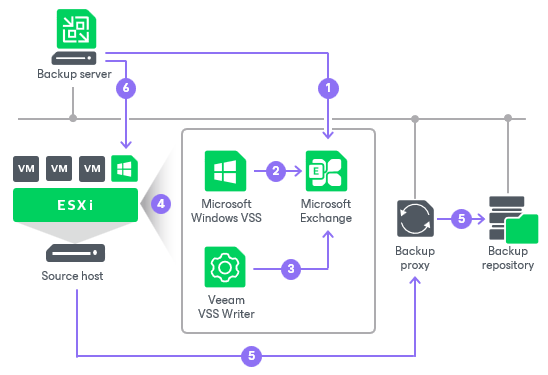

# Persistent VSS Snapshots

In this article

During application-aware processing, Veeam Backup & Replication uses a VSS writer for a required application to freeze application data and bring it to a consistent state.

According to Microsoft limitations, applications cannot be kept frozen longer than 60 seconds (20 seconds for Microsoft Exchange). If the Microsoft VSS writer keeps application data frozen longer than this period, a VSS processing timeout occurs, and Veeam Backup & Replication fails to create a transactionally consistent backup of the VM. The VSS processing timeout is a common problem for highly transactional applications such as Microsoft Exchange.

To overcome this limitation, Veeam Backup & Replication uses the persistent VSS snapshots technology for the backup of Microsoft Exchange VMs. If Microsoft Exchange has to be kept frozen for a longer period of time than the allowed one, Veeam Backup & Replication automatically fails over to the persistent VSS snapshot mechanism.

Backup of Microsoft Exchange VMs is performed in the following way:

1. Veeam Backup & Replication triggers the Microsoft VSS framework to prepare Microsoft Exchange on the VM for backup.
2. The Microsoft VSS writer attempts to quiesce Microsoft Exchange.
3. If the Microsoft VSS writer fails to quiesce Microsoft Exchange within the allowed period of time, the control is passed to the native Veeam VSS writer. The Veeam VSS writer holds the freeze operation for the necessary amount of time.
4. After Microsoft Exchange data is brought to a consistent state, the control is passed to the Microsoft VSS provider. The Microsoft VSS framework creates a persistent VSS snapshot for VM disks except the system VM disk.
5. The job session proceeds as usual.
6. After the backup operation is complete, Veeam Backup & Replication triggers Microsoft VSS to remove the persistent VSS snapshot on the production VM. The persistent VSS snapshot holding consistent application data inside the created VM backup remains.

During the entire VM restore, Veeam Backup & Replication recovers data from the backup and reverts VM disks to the persistent VSS snapshot inside the backup. As a result, the Microsoft Exchange VM is restored from the backup in a consistent state without data loss.

Limitations for Persistent VSS Snapshot Technology

Veeam Backup & Replication uses the persistent VSS snapshot technology if the VM meets the following requirements:

* The version of Microsoft Exchange installed on the VM is listed in the [Supported Applications](platform_support.md#guest) section of [Supported Platforms, Applications and Workloads](platform_support.md).
* The VM does not perform the role of a domain controller.
* Microsoft Exchange databases and log files are located on a non-system disk of the VM. During backup, Veeam Backup & Replication does not trigger a persistent VSS snapshot for system VM disks. As a result, system disks are restored in a crash-consistent, not transactionally consistent state.

Page updated 5/26/2025

Page content applies to build 13.0.1.1071
