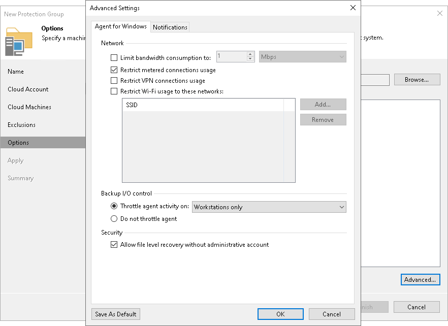

# Notification Settings

You can specify email notification settings for the protection group. If you enable notification settings, Veeam Backup & Replication will send a daily email report with protection group statistics to a specified email address. The report contains cumulative statistics for rescan job sessions performed for the protection group within the last 24-hour period.

|  |
| --- |
| NOTE |
| Email reports with protection group statistics will be sent only if you configure global email notification settings in Veeam Backup & Replication. For more information, see [Configuring Global Email Notification Settings](general_email_notifications.md).  After you enable notification settings for the protection group, in addition to reports sent according to the global email notification settings, Veeam Backup & Replication will send reports with the protection group statistics to email addresses specified in the protection group settings. This allows you to fine-tune email notifications in Veeam Backup & Replication: while one or more backup administrators receive email notifications according to the global settings, other backup administrators can receive reports for specific protection groups only.  If you do not enable global email notification settings in Veeam Backup & Replication, notification settings for the protection group will not be sent even if you enable them in the protection group settings. |

To specify notification settings for the protection group:

1. At the Options step of the wizard, click Advanced.
2. Click the Notifications tab.
3. Select the Send daily agent status report e-mail to the following recipients check box and specify a recipient’s email address. You can enter several addresses separated by a semicolon.
4. In the Send daily summary at field, specify the time when Veeam Backup & Replication must send the daily email report for the protection group.
5. You can choose to use global notification settings or specify custom notification settings.

To receive a typical notification for the protection group, select Use global notification settings. In this case, Veeam Backup & Replication will apply to the protection group global email notification settings specified for the backup server.

To configure a custom notification for the protection group, select Use custom notification settings specified below. You can specify the following notification settings:

* In the Subject field, specify a notification subject. You can use the following variables in the subject:

* %JobResult% — rescan job result.
* %PGName% — protection group name.
* %FoundCount% — number of new computers discovered within the last 24-hour period.
* %TotalCount% — total number of computers in the protection group.
* %SeenCount% — number of computers in the protection group that were online for the last 24 hours. A computer is considered to be online if Veeam Backup & Replication successfully connected to this computer during the last rescan session.

* Select the Notify on success, Notify on warning and Notify on error check boxes to receive email notification if the protection group rescan job completes successfully, completes with a warning or fails.

