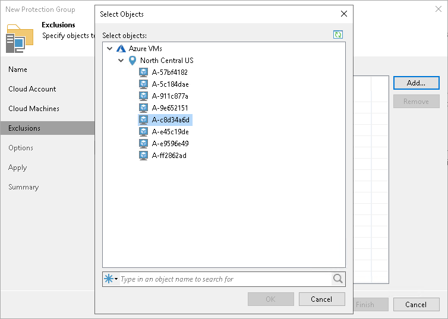
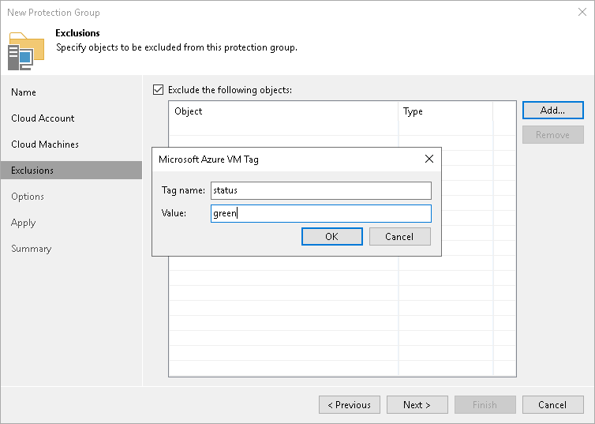

# Step 5. Exclude Objects from Protection Group

In this article

At the Exclusions step of the wizard, you can specify which objects you want to exclude from the protection group. You can exclude the following types of objects:

* [Specific cloud machines](#cloud).

* [Cloud machines with specific metadata tags](#tag).

With this option selected, you must specify cloud machines or metadata tags that you want to exclude from the protection group.

Excluding Individual Cloud Machines

To exclude an individual cloud machine:

1. Click Add > Machines.
2. In the Select Objects window, select the necessary cloud machine in the list and click OK. You can press and hold the [Ctrl] key to select multiple machines at once.

To quickly find the necessary object, use the search field at the bottom of the Select Objects window.

1. Enter the object name or a part of it in the search field.
2. Click the Start search button on the right or press [Enter].

Excluding Cloud Machines Using Tags

To exclude cloud machines using a metadata tag:

1. Click Add > Tags.
2. In the Tag window:

1. In the Key field, specify a key for the tag.
2. In the Value field, specify a value for the tag.

|  |
| --- |
| IMPORTANT |
| Make sure to use only lowercase symbols. |

Page updated 8/21/2024

Page content applies to build 13.0.1.1071
