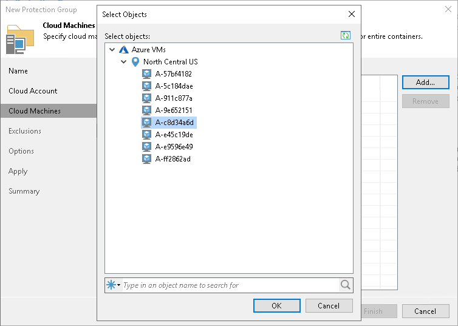
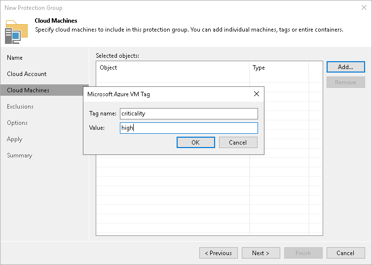

# Step 4. Specify Cloud Machines

In this article

At the Cloud Machines step of the wizard, specify cloud machines that you want to add to the protection group. To do this, you can select individual cloud machines, whole datacenters, or specify metadata tags.

Adding Individual Cloud Machine or Datacenter

To add an individual cloud machine or datacenter to a protection group:

1. Click Add > Machines.
2. In the Select Objects window, select the necessary object in the list and click OK. You can press and hold the [Ctrl] key to select multiple objects at once.

To quickly find the necessary object, use the search field at the bottom of the Select Objects window.

1. Enter the object name or a part of it in the search field.
2. Click the Start search button on the right or press [Enter].

Adding Cloud Machines Using Metadata Tag

To add a tag:

1. Click Add > Tags.
2. In the Tag window:

1. In the Key field, specify a key for the tag.
2. In the Value field, specify a value for the tag and click OK.

|  |
| --- |
| IMPORTANT |
| Make sure to use only lowercase symbols. |

Page updated 8/21/2024

Page content applies to build 13.0.1.1071
