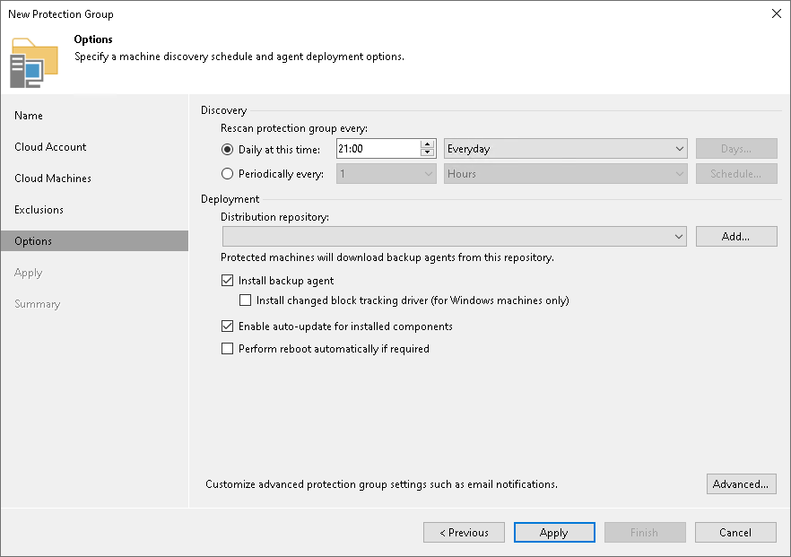

# Step 7. Specify Discovery and Deployment Options

At the Options step of the wizard, specify settings for protected machines discovery and Veeam Agent deployment.

Veeam Backup & Replication regularly connects to protected machines according to the schedule defined in the protection group settings. At this step of the wizard, you can define the discovery schedule and specify operations that Veeam Backup & Replication must perform on discovered machines. You can also select which server in your backup infrastructure should act as a distribution server for Veeam Agents.

To specify discovery and deployment options, do the following:

1. In the Discovery section, define schedule for automatic discovery within the scope of the protection group:

* To run the rescan job at specific time daily, on defined week days or with specific periodicity, select Daily at this time. Use the fields on the right to configure the necessary schedule.
* To run the rescan job repeatedly throughout a day with a specific time interval, select Periodically every. In the field on the right, select the necessary time unit: Hours or Minutes. Click Schedule and use the time table to define the permitted time window for the rescan job. In the Start time within an hour field, specify the exact time when the job must start.

* To run the rescan job continuously, select the Periodically every option and choose Continuously from the list on the right. A new rescan job session will start as soon as the previous rescan job session finishes.

|  |
| --- |
| NOTE |
| You cannot create a protection group without defining schedule for automatic discovery. However, you can disable automatic discovery for a specific protection group, if needed. To learn more, see [Disabling Protection Group](agents_protection_group_disable.md). |

1. In the Deployment section, from the Distribution repository list, select a Microsoft Azure blob storage or Amazon S3 storage repository that you plan to use as a distribution repository. Veeam Backup & Replication will use the distribution repository to upload Veeam Agent setup files to cloud machines added to the protection group.

If you have not added the necessary repository to your infrastructure before, click Add to add a new repository. To learn more, see [Adding Azure Blob Storage](osr_adding_blob_storage.md) or [Adding Amazon S3 Storage](osr_amazon_adding.md).

|  |
| --- |
| IMPORTANT |
| If you plan to use the Azure Blob Storage repository as a distribution repository, consider the following:   * You must add a repository using a general-purpose v2 storage account. Other account types are not supported. * A Microsoft Azure Compute Account must be in the same subscription as the storage account specified in the settings of the Azure Blob Storage repository used as a distribution repository. * You cannot add a repository using the Microsoft Entra ID account. |

1. If you want Veeam Backup & Replication to automatically deploy Veeam Agents on all discovered computers in the protection group, in the Deployment section, select the Install backup agent check box.

You can also choose to disable automated Veeam Agent installation. In this case, you must install Veeam Agent manually on every computer included in the protection group and discovered by Veeam Backup & Replication. To learn more, see [Installing Veeam Agent](agents_protected_computers_install.md).

Note that Veeam Backup & Replication installs Veeam Installer Service or Veeam Deployer Service, Veeam OpenSSL3 FIPS Provider and Veeam Transport Service on every computer added to the protection group even if the Install backup agent check box is not selected in the protection group settings. If Veeam Transport Service is already installed on a computer, Veeam Backup & Replication checks its version and upgrades the service if a later version is available.

* [For Windows-based computers] To install the advanced changed block tracking (CBT) driver on computers protected with Veeam Agent for Microsoft Windows, select the Install changed block tracking driver check box. Veeam Backup & Replication installs the CBT driver only on computers that run supported Microsoft Windows OS versions. To learn more, see [Installing Veeam CBT Driver](agents_protected_computers_driver.md).

|  |
| --- |
| Tip |
| Veeam Backup & Replication can install the CBT driver on a wider range of Microsoft Windows OS versions, but does not install drivers automatically after upgrade. To install drivers in an existing protection group on computers running OS versions that became supported only in Veeam Backup & Replication 13.1, open the Edit Protection Group wizard, make sure that the Install changed block tracking driver check box is selected and save the protection group again. |

* [For Linux-based computers] To install the nosnap version of Veeam Agent for Linux on protected Linux computers in this protection group, select the Install nosnap backup agent check box.

|  |
| --- |
| Note |
| The Install nosnap backup agent check box does not enable agent deployment. It only specifies that if Veeam Backup & Replication installs Veeam Agent for Linux on a protected Linux computer in this protection group, Veeam Backup & Replication installs the nosnap version of Veeam Agent for Linux. For automatic installation during a rescan job, you must also select the Install backup agent check box. You can also install nosnap Veeam Agent for Linux manually on individual computers in the protection group. For more information, see [Installing Veeam Agent](agents_protected_computers_install.md). |

1. If you want to instruct Veeam Backup & Replication to automatically upgrade Veeam Agent on discovered computers when a new version of Veeam Agent appears on the Veeam Backup & Replication server, select Enable auto-update for installed components.
2. Select Perform reboot automatically if required to allow Veeam Backup & Replication to reboot a protected computer. In particular, the reboot operation is required as part of the Veeam CBT driver installation process.
3. Click Advanced to specify advanced settings for the protection group. To learn more, see [Specify Advanced Protection Group Settings](ad_objects_advanced.md).

Page updated 2026-07-02

