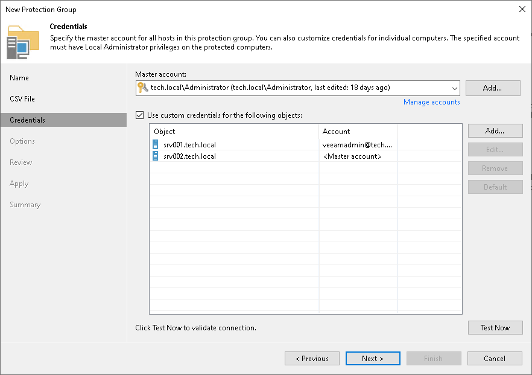

# Step 4. Specify Credentials

In this article

At the Credentials this step of the wizard, specify credentials to connect to computers included in the protection group:

1. If you want to use the same credentials for all computers in the protection group, select the necessary user account from the Master account list. The account must have local administrator permissions on all computers that you have added to the protection group.

If you have not set up credentials beforehand, click the Manage accounts link or click Add on the right to add credentials.

The user name can be specified in the following formats:

* DNS.DOMAIN.NAME\USERNAME
* USERNAME@DNS.DOMAIN.NAME
* HOSTNAME\USERNAME — if you use Veeam Backup & Replication on Microsoft Windows
* DOMAIN\USERNAME — if you use Veeam Backup & Replication on Microsoft Windows

1. By default, Veeam Backup & Replication uses credentials specified in the Master account field for all computers in the protection group. If some computer requires a different user account, do the following:

1. Select the Use custom credentials for the following objects check box.
2. Click Add next to the list of objects and select in the Add Objects window one or more computers listed in a CSV file and add them to the Use custom credentials for the following objects list.
3. In the Use custom credentials for the following objects list, select the necessary object, click Edit and select custom credentials for the object.

If you have not set up credentials beforehand, click Add and add the following types of credentials:.

* Stored credentials. Select stored credentials if you want Veeam Backup & Replication to use the specified user name and password for each connection to Veeam Agent.
* [For Linux computers] Single-use credentials. Select single-use credentials if you do not want Veeam Backup & Replication to store credentials in the configuration database. With this option selected, Veeam Backup & Replication will use the specified user name and password only for the first connection to Veeam Agent. After that, Veeam Backup & Replication will use Veeam Transport Service to communicate with the Veeam Agent computer.

Credentials must be specified in the following format:

* For Active Directory accounts, if you use Veeam Backup & Replication on Linux — DNS.DOMAIN.NAME\USERNAME or USERNAME@DNS.DOMAIN.NAME.
* For Active Directory accounts, if you use Veeam Backup & Replication on Microsoft Windows — DOMAIN\USERNAME, DNS.DOMAIN.NAME\USERNAME or USERNAME@DNS.DOMAIN.NAME.
* For local accounts — USERNAME or HOSTNAME\USERNAME.

|  |
| --- |
| NOTE |
| Consider the following:   * If you plan to back up Oracle databases that run on Linux computers, the OS account used to connect to the computer must be a member of the group that owns configuration files of the Oracle database (for example, the oinstall group). * You cannot use a Microsoft Entra ID account to connect to computers included in the protection group. * If you use Veeam Backup & Replication on Microsoft Windows, the user account that you use to connect to a Linux computer must have a home directory, users without home directories are not supported. |

To check if Veeam Backup & Replication can connect to computers added to the protection group, click Test Now. Veeam Backup & Replication will form a list of computers to connect and use the specified credentials to connect to computers in the list.

Page updated 11/6/2025

Page content applies to build 13.0.1.1071
