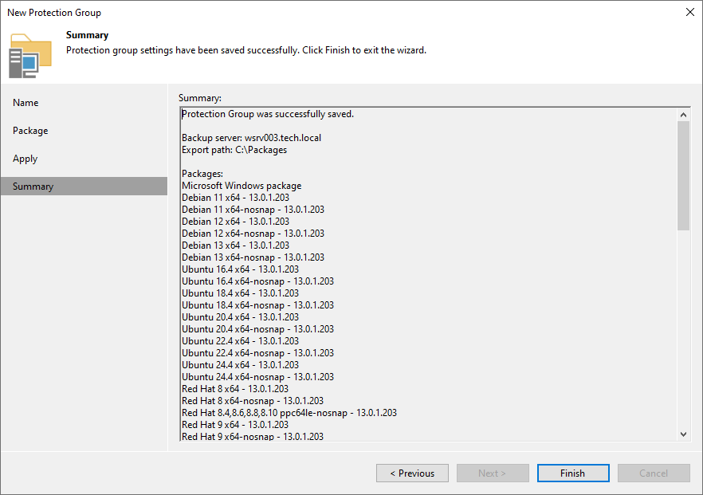

# Step 6. Finish Working with Wizard

At the Summary step of the wizard, complete the protection group configuration process.

1. Review information about the created protection group.
2. Click Finish to close the wizard.

|  |
| --- |
| TIP |
| After you finish the protection group creation, install Veeam Agent on computers in the protection group. To learn more, see [Deploying Veeam Agents Using Generated Setup Files](agents_deploy_package.md). |

