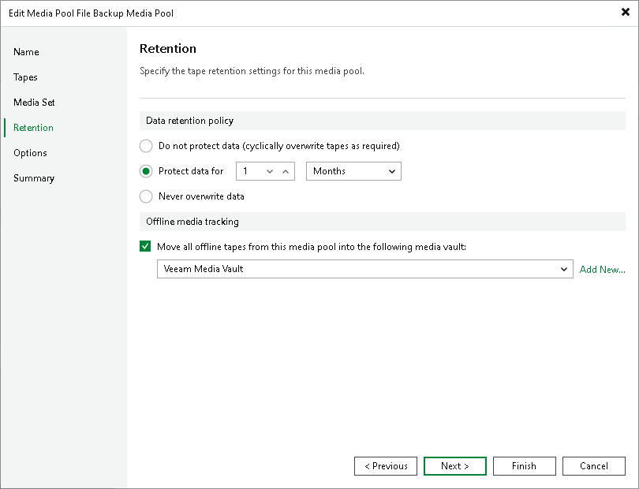
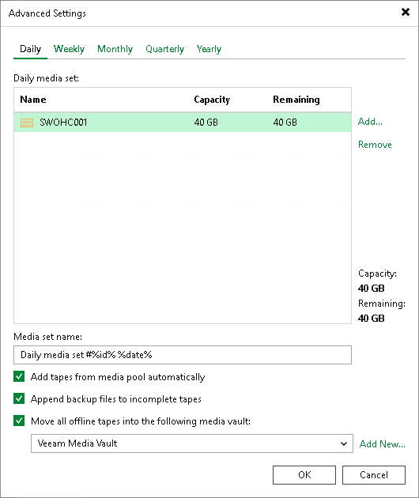

# Moving Tapes to Vault

Recorded tapes can be moved to a vault. In the vault, you can view tape information, including data written to tape and data retention settings.

If the tapes are placed to a vault, you can still view them under the Offline node or in the media pool.

You can move the tapes manually or instruct the relevant media pool to place the tapes to a vault automatically.

In This Section

* [Moving tapes to vault manually](placing_tapes_to_vault.md#move_manually)
* [Automatic vaulting for media pools](#automove_custompool)
* [Automatic vaulting for GFS media pools](placing_tapes_to_vault.md#automove_gfspool)

Moving Tapes to Vault Manually

You can move only tapes that contain data and that are offline. To move the tapes manually:

1. Open the Tape Infrastructure view.
2. Navigate to the list of tapes either under the Media Pools or under the Libraries > LibraryName node > Media > Offline.
3. In the working area, right-click the tapes you want to move and select Move to Vault. Choose the vault you need.

Automatic Vaulting for Media Pools

To set the automatic placing of tapes to a vault, you need to configure the media pool where the target tapes are recorded. To configure a media pool:

1. Open the Tape Infrastructure view.
2. Navigate to the Media Pools node.
3. Select the media pool you want to customize.
4. Click Edit Media Pool on the ribbon. Alternatively, you can right-click the media pool and select Properties.
5. Go to the Retention step of the Edit Media Pool wizard. In the Offline media tracking field, select Move all offline tapes from this media pool into the following media vault. Select the needed vault from the drop-down list.

Note that moving tapes to a vault automatically will not be available if you select Do not protect data (cyclically overwrite tapes as required) option as a data retention policy.

|  |
| --- |
| Tip |
| If you have not previously created a vault, you can click the Add New button and create a new vault without closing the job wizard. For more information, see [Creating Vaults](creating_media_vaults.md). |

Automatic Vaulting for GFS Media Pools

Vaulting of GFS tapes is set for media sets individually. To change a media set configuration:

1. Open the Tape Infrastructure view.
2. Navigate to the Media Pools node. Select the GFS media pool you want to customize.
3. Click Edit Media Pool on the ribbon. Alternatively, you can right-click the media pool and select Properties.
4. Go to the GFS Media Set step of the Edit Media Pool wizard and click Advanced. Select a tab with the needed media set and select Move all offline tapes into the following media vault. Select the needed vault from the drop-down list.

|  |
| --- |
| Tip |
| If you have not previously created a vault, you can click the Add New button and create a new vault without closing the job wizard. For more information, see [Creating Vaults](creating_media_vaults.md). |

