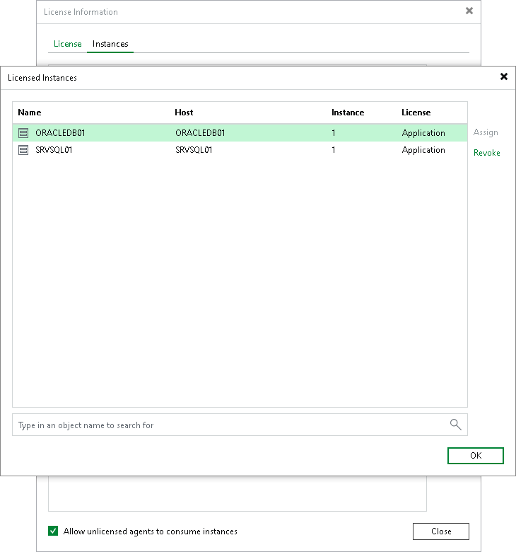

# Licensing

In this article

The Veeam Plug-In management functionality is licensed by the number of instances. Instances are units (or tokens) that you can use to protect your computers with Veeam Plug-Ins. If the license is not valid or out of resources, Veeam Plug-In backup jobs fail.

The number of instances that you can use depends on the type of license installed in Veeam Backup & Replication:

* For Veeam Universal Licensing (VUL)

You can use Veeam Plug-Ins with all license packages (Veeam Backup Essentials, Veeam Backup & Replication, Veeam Availability Suite).

Keep in mind that if you use the Rental license type, functionality of Veeam Plug-Ins is supported only for the Enterprise Plus edition of Veeam Backup & Replication.

* For Perpetual Socket license

Functionality of Veeam Plug-Ins is supported only for the Enterprise Plus edition of Veeam Backup & Replication.

For the full list of license packages, see [this Veeam webpage](https://www.veeam.com/backup-solution-pricing.html).

Obtaining and Managing Licenses

For details on how to install a license and monitor licensed objects, see [Licensing](licensing.md) for Veeam Backup & Replication.

Managing Veeam Plug-In Instance License Consumption

You can assign and revoke licenses for installed instances protected by Veeam Plug-Ins from the Veeam backup server. This process helps you manage license usage and ensure only intended installed instances consume licenses.

To assign or revoke license usage of individual instances, do the following:

1. From the main menu, select License.
2. In the License Information window, click the Instances tab and click Manage.
3. In the Licensed Instances tab, select the installed instance and click Assign to assign a license instance, or click Revoke to revoke a license instance.
4. Click Close.

Page updated 11/4/2025

Page content applies to build 13.0.1.1071
