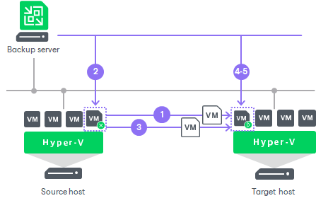

# Planned Failover

Planned failover is a process when you manually launch switching from a primary VM to its replica with minimum interrupting in operation. Planned failover is helpful when you know that your primary VMs are about to go offline and you need to proactively switch the workload from source VMs to their replicas. You can use the planned failover, for example, if you plan to perform datacenter migration, maintenance or software upgrade of the primary VMs. You can also perform planned failover if you have noticed some signs of the approaching disaster.

As the procedure is designed to transfer the current workload to the replica, it does not suggest selecting a restore point to switch.

When you start the planned failover, Veeam Backup & Replication performs the following operations:

1. The failover process triggers the replication job to perform an incremental replication run and copy the un-replicated changes to the replica.
2. The VM is powered off.
3. The failover process triggers the replication job to perform another incremental replication run and copy the portion of last-minute changes to the replica. The replica becomes fully synchronized with the source VM.
4. The VM is failed over to its replica.
5. The VM replica is powered on.

During the planned failover, Veeam Backup & Replication creates two helper restore points (steps 1 and 3) that are not deleted afterwards. You can see these restore points in the list of restore points for the VM. You can use the restore points later to roll back to the necessary VM replica state.

|  |
| --- |
| Note |
| During planned failover, Veeam Backup & Replication always retrieves VM data from the production infrastructure, even if the replication job uses the backup as a data source. This approach helps Veeam Backup & Replication synchronize the VM replica to the latest state of the production VM. |

Finalizing Planned Failover

When your primary host is online again, you can switch back to it. You can finalize planned failover in the same ways as regular failover: undo failover, perform permanent failover or failback.

Limitations for Planned Failover

Planned failover has the following limitations:

* If you start planned failover for several VMs that are replicated with one replication job, these VMs will be processed one by one, not in parallel.
* Each planned failover task for each VM is processed as a separate replica job session. If a backup proxy is not available and the session has to wait for resources, job sessions for other VMs in the same task cannot be started before the current session is finished.
* The user account under which you launch the planned failover operation must have the Veeam Backup Administrator role or Veeam Backup Operator and Veeam Restore Operator roles in Veeam Backup & Replication. For more information, see [Managing Users and Roles](users_roles.md).

Related Topics

* [Performing Planned Failover](performing_planned_failover_hv.md)
* [Undoing Failover](failover_undo_hv.md)
* [Performing Failback](performing_failback_hv.md)
* [Performing Permanent Failover](failover_permanent_hv.md)

