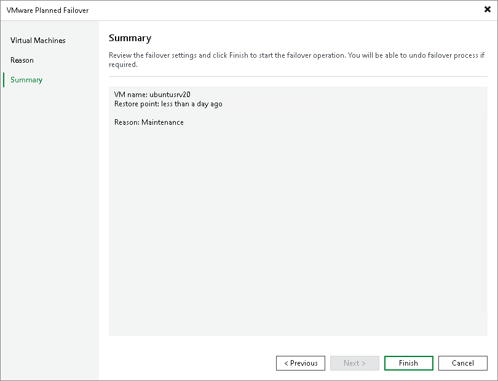

# Step 4. Finish Working with Wizard

At the Summary step of the wizard, review details of the failover task and click Finish to start the failover process. Once planned failover is complete, VM replicas will be started on the target host.

What You Do Next

Planned failover is an intermediate step that needs to be finalized. You can finalize failover in the following ways:

* [Perform permanent failover](failover_permanent.md).
* [Undo failover](failover_undo.md).
* [Perform failback](performing_failback.md).

