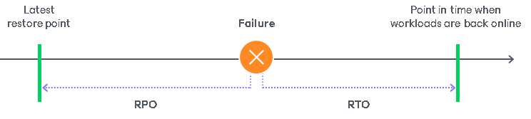

# Planning and Preparation

In this article

Infrastructure of Veeam Backup & Replication depends on the business needs and resources of your company. Before you install Veeam Backup & Replication, make sure that your backup infrastructure meet product hardware recommendations and system requirements. For more information, see these sections:

* [Supported Platforms, Applications and Workloads](platform_support.md)
* [Deployment Scenarios](deployment_scenarios.md)
* [System Requirements](system_requirements.md)
* [Permissions](required_permissions.md)
* [Ports](used_ports.md)
* [Naming Conventions](naming_conventions.md)

Before you deploy Veeam Backup & Replication, consider the following tips and recommendations that may help you design your backup infrastructure:

1. [Define protection scope](#step1).
2. [Define RTO and RPO goals](#step2).
3. [Select Veeam Backup & Replication features that you will need](#step3).
4. [Plan how many copies of your data you need to store (3-2-1 rule)](#step4).
5. [Design Veeam Backup & Replication infrastructure](#step5).

Step 1. Define Protection Scope

Define how many machines you need to protect and the amount of disk space the machines use.

After defining the protection scope, calculate how much of the total amount of data is actually changing on a daily basis. This information is required because of the mechanism of how Veeam Backup & Replication creates a backup chain. At the first run, Veeam Backup & Replication creates a full backup file; at the second and further runs, Veeam Backup & Replication creates an incremental backup file that contains only the blocks that has been changed since the last backup. As a result, the daily change rate has a significant impact on the backup window and the storage capacity needed to store the backups. As Veeam Backup & Replication creates image-level or block level backups, you need to know the daily change rate on the block level. For VMware vSphere or Microsoft Hyper-V, you can use Veeam ONE to measure and generate a report on the daily change rate of VMs.

As a result of this step, you can make a list of machines to be protected, including the data on which of the machines contain databases, which of the machines host business critical applications, and how much of the total amount of data is changing on these machines on a daily basis. This information will help you in further steps of deployment planning.

Step 2. Define RPO and RTO

When you make a business continuity and disaster recovery plan, you must define two important parameters: Recovery Point Objective (RPO) and Recovery Time Objective (RTO).

* RPO defines a period during which you may accept to lose data. Basically, it is the age of the latest backup that will be used for recovery in case of a failure. It means that your company accepts that in case of a failure you may lose the data that has been accumulated since the latest restore point. RPO set by the policy of your company defines how often you need to create a recovery point. This will help you estimate how much storage you will need to store backups, how many copies of your data you need, and which Veeam Backup & Replication features are the most suitable for business needs of your company.
* RTO is related to downtime. RTO represents the amount of time from the beginning of an incident until all services are back online and available to users.

Define a list of your workloads grouped and organized by how fast they must be recoverable. Divide the list into categories. The higher the recovery priority, the lower the RTO will be required relative to the rest of your workloads.

Step 3. Select Veeam Backup & Replication Features

Based on the analysis of your RTO and RPO, you can define your protection plan and select which features are the most suitable for your business needs. It is a common practice to divide servers and applications into categories and use different protection functionality for each category based on SLA (service level agreement). You can take the following table as a reference.

|  | RPO: Seconds | RPO: Minutes | RPO: Hours (<24h) | RPO: Hours (24-48) |
| --- | --- | --- | --- | --- |
| RTO: Seconds | [Continuous Data Protection (CDP)](cdp_replication.md) (for VMware vSphere) | [Replication](replication.md) |  |  |
| RTO: Minutes |  | [Snapshot Orchestration](schedule_snapshots.md) (for VMware vSphere) | [Backup](backup.md) | [Backup Copy](backup_copy.md) |
| RTO: Hours |  |  |  | [Tape Device Support](tape_device_support.md) |

Apart from backup and replication options, the RTO also depends on the method of recovery and recovery verification. Veeam Backup & Replication offers a number of recovery options for various disaster recovery scenarios, including Instant Recovery, image-level restore, file-level restore, restore of application items and so on. For details, see the following sections:

* [Restore](data_recovery.md): performing restore from backup files to the original or a new location.

* [Recovery Verification](surebackup_recovery_verification.md): testing VM backups and replicas before recovery.

Step 4. Plan How Many Copies of Data You Need (3-2-1 rule)

To build a successful data protection and disaster recovery plan, we recommend that you follow the 3-2-1 rule:

* 3: You must have at least three copies of your data: the original production data and two backups. The first copy of your data is the original production data. The second copy of your data is a backup created by a backup job. To create the third copy of data you can use [Backup Copy](backup_copy.md) or [Backup to Tape](backup_to_tape_jobs.md) jobs. Also, if you use cloud repositories (S3, Azure Blob, Google Cloud, IBM Cloud), you can [copy backups to a capacity tier](capacity_tier_data_transfer.md).
* 2: You must use at least two different types of media to store the copies of your data.
* 1: You must keep at least one backup off-site. For example, in the cloud or in a remote site. One of the repositories must be offline, air-gaped or immutable.

Veeam Backup & Replication provides integration with various types of repositories. Select where you want to store your backup files. For the full list of supported backup repositories, see [Backup Repository](backup_repository.md), [Tape Device Support](tape_device_support.md), [Storage System Snapshot Integration](storage_integration.md).

To plan the required space on repositories, you may also need to analyze for how long will you store the backups. Veeam Backup & Replication provides short-term and long-term (GFS) retention policies to effectively store the backup files.

Step 5. Design Veeam Backup & Replication Infrastructure

Veeam Backup & Replication can be used in virtual environments of any size and complexity. The architecture of the solution supports on-site and off-site data protection, operations across remote sites and geographically dispersed locations. Veeam Backup & Replication provides flexible scalability and easily adapts to the needs of your virtual environment.

|  |
| --- |
| Note |
| Consider [general security recommendations](general_security_considerations.md) and [recommendations for hardening specific backup infrastructure components](securing_backup_infrastructure.md) when designing Veeam Backup & Replication infrastructure. |

Before you install Veeam Backup & Replication, familiarize yourself with common deployment scenarios and plan your backup infrastructure layout. For details, see [Deployment Scenarios](deployment_scenarios.md).

The easiest way to start is to deploy a Veeam Backup & Replication server, one dedicated server for a proxy (backup proxy or off-host proxy) and one repository. While you keep adding backup jobs, add more proxies and repositories. Each backup infrastructure component has its own specifics and requirements that are described in the following sections of this guide:

* [Veeam Backup & Replication Server](backup_server.md)
* [VMware Backup Proxy](backup_proxy.md) or [Off-Host Backup Proxy](offhost_backup_proxy.md)
* [Backup Repository](backup_repository.md)

Also, note that in most cases, it is recommended to deploy Veeam Backup & Replication, Veeam Backup Enterprise Manager and Veeam ONE on separate servers.

Page updated 10/20/2025

Page content applies to build 13.0.1.1071
