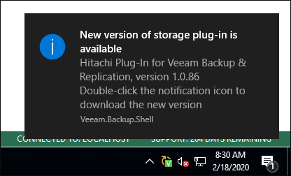

# Update Notifications on Microsoft Windows-Based Backup Server

[The following information applies to the Microsoft Windows-based backup server.]

Veeam Backup & Replication uses update notifications to inform you about new versions of Universal Storage API integrated system plug-ins. When a new version of a plug-in becomes available on the website, Veeam Backup & Replication displays a notification in the Windows Action Center (or an icon in the system tray for earlier Windows versions). If the update is not installed, this notification will keep appearing once a week as a reminder.

To get a new version of a plug-in, click the notification. Veeam Backup & Replication will open a Veeam KB article where you can find release information and download the plug-in.

To install the plug-in, follow the steps described in section [Installing Storage System Plug-Ins](storage_install_plugin.md).

