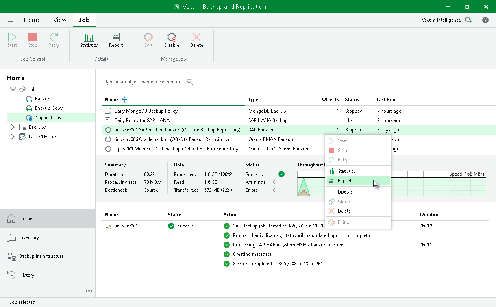

# Generating Backup Job Reports

Veeam Backup & Replication can generate reports with details about an SAP HANA backup job session performance. The session report contains the following session statistics: session duration details, details of the session performance, amount of read, processed and transferred data, backup size, compression ratio, list of warnings and errors (if any).

1. Open the Home view.
2. In the Home view, expand the Jobs node in the inventory pane and click Applications.
3. In the working area, select the necessary job and click Report on the ribbon. You can also right-click the job and select Report.

