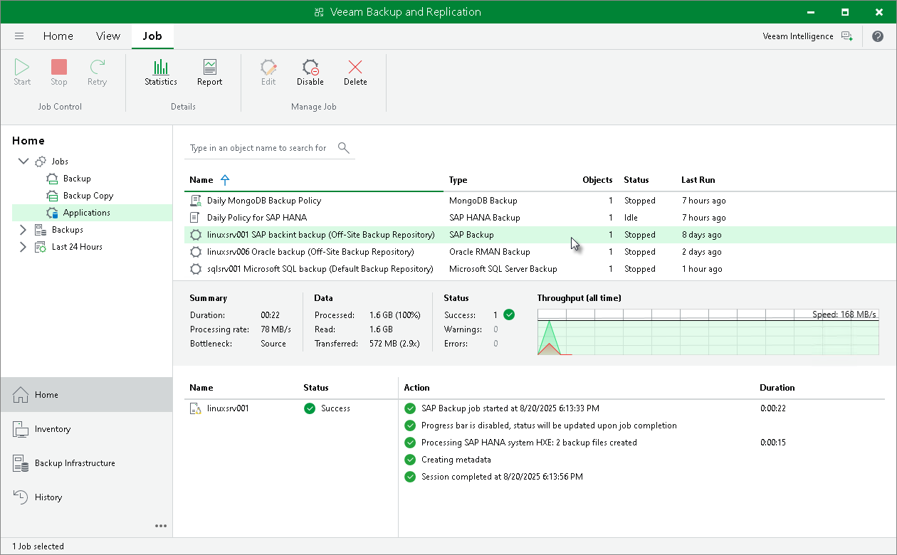

# Viewing Backup Job Statistics

To view details of a backup job process, do the following:

1. Open the Veeam Backup & Replication console.
2. In the Home view, expand the Jobs node and click Applications.
3. In the list of jobs, select the SAP HANA backup job to see details of the current backup process or the last backup job session.

