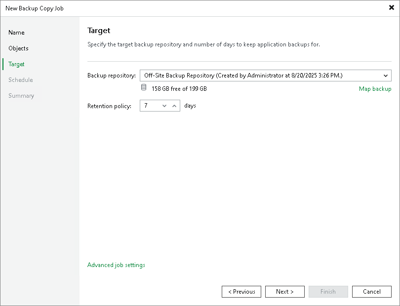

# Step 4. Define Backup Copy Target

At the Target step of the wizard, configure the target repository settings.

1. From the Backup repository list, select a backup repository in the target site where copied backups must be stored. When you select a target backup repository, Veeam Backup & Replication automatically checks how much free space is available on it. Make sure that you have enough free space to store copied backups.

|  |
| --- |
| Important |
| For Veeam Plug-In backup copy jobs, you cannot select the [Veeam Cloud Connect repository](https://helpcenter.veeam.com/docs/vbr/cloud/cloud_connect_configure_repository.html?ver=13) as a backup copy target. |

1. If the target repository contains a Veeam Plug-In or MongoDB backup that was excluded from the backup copy job, and if you don't want to transfer duplicate data, you can use the mapping feature.

After you configure mapping, if some of backup files (.VAB) of the source backup are missing in the target backup copy, these files are uploaded to the target backup copy.

|  |
| --- |
| Note |
| Veeam Plug-In backup copy jobs do not use WAN accelerators. |

To map a backup copy job to the backup:

1. Click the Map backup link.
2. Point the backup copy job to the backup in the target backup repository. Backups in the target backup repository can be easily identified by backup job names. To facilitate search, you can use the search field at the bottom of the window.

|  |
| --- |
| Important |
| Keep in mind that repositories must meet the following requirements:   * Used account must have access to Veeam backup repositories that you plan to use. * Encryption must be disabled on the repository.   Otherwise, the repositories will not be listed as available. For details on how to configure access permissions and encryption settings on repositories, see [Editing Access Permissions](access_permissions.md). |

1. With the Retention policy field, you can specify the number of days after which Veeam Backup & Replication deletes the backup copy file from the repository. Veeam Backup & Replication checks the backup copies created by the job every 24 hours and deletes the ones that are older than the specified value. The countdown starts from the moment when source backup has been created.

|  |
| --- |
| Note |
| [For Veeam Plug-In for Microsoft SQL Server] As part of retention, Veeam Backup & Replication performs the force delete operation. If the job no longer processes a database and the most recent restore point of this database is older than the retention period specified in the job settings, the job deletes all backups of this database from the backup files (.VAB). For more information on the logic behind the force delete operation, see [Force Delete Operation](mssql_retention_tools_force_delete.md). |

Page updated 2026-07-21

