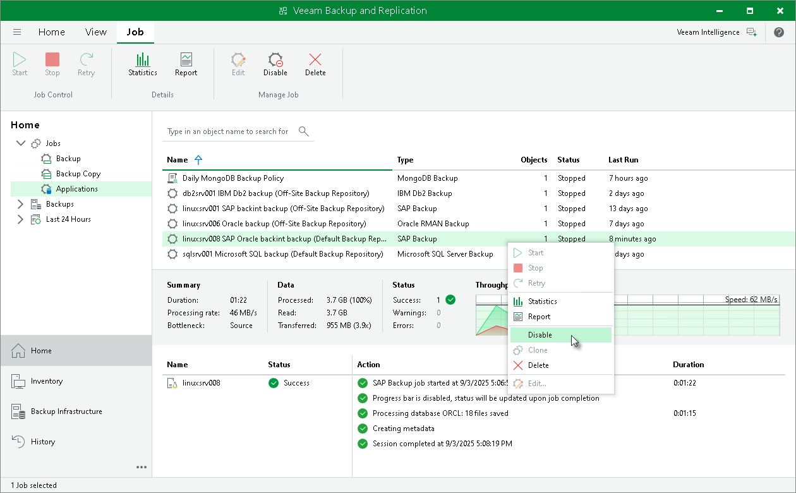

# Disabling Backup Job

You can disable BR\*Tools backup jobs in the Veeam Backup & Replication console. If you disable the job, you will not be able to run BR\*Tools backup commands on the SAP on Oracle server.

To disable a backup job:

1. Open the Home view.

1. In the Home view, expand the Jobs node in the inventory pane and click Applications.

1. In the working area, select the necessary job and click Disable on the ribbon. You can also right-click the job and select Disable.

