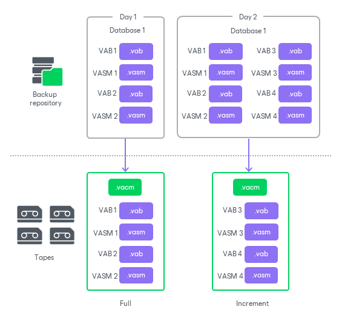

# Backup to Tape for Veeam Plug-In Backups

You can use a backup to tape job as a secondary job for your Veeam Plug-In backups to additionally secure the database backups in a tape format. As with standard backup to tape jobs, as the source job, you can specify any Veeam Plug-In backups created in standalone or managed mode, or Veeam Plug-In backups produced by backup copy jobs, or source repositories containing any of such backups.

To archive Veeam Plug-In backups to tape, you need to create a backup to tape job. For more information, see [Creating Backup to Tape Jobs](creating_backup_to_tape_jobs.md).

Considerations and Limitations

If you plan to back up Veeam Plug-In backups to tape, consider the following:

* Backup to tape for Veeam Plug-In backups is a secondary backup as it copies already backed up database server data. Thus, this functionality does not consume additional license instances.
* The restore points for Veeam Plug-In backups to tape are created in the following way:

* The full backup processes the entire repository backup chain — it copies all closed plug-in backup files existing at the time the backup job runs.
* The incremental backup copies any new closed plug-in backup files created from the time of the previous backup to tape job run.

|  |
| --- |
| Note |
| It is strongly recommended to align the tape job schedule with the source Veeam Plug-In backup job schedule to avoid a significant amount of backup file changes in the source repository between backup to tape job runs. |

* Veeam Plug-In backup files on tapes are stored in the native Veeam Plug-In format: VACM, VAB and VASM. You can browse the created archive on tape using the Files view. For more information, see [Viewing Files and Objects on Tape](view_files_on_tape.md).

* Veeam Plug-In backup to tape does not support [GFS](gfs_jobs.md) retention.

* To enable periodic full backups for Veeam Plug-In backup to tape, you must have the Export virtual full backup even for backup chains with periodic fulls checkbox selected at the [Media Pool](backup_to_tape_pools.md) step of the Backup to Tape wizard.

The virtual full backups for Veeam Plug-In backup to tape are processed as a scheduled full backup. On the virtual full day, Veeam Backup & Replication runs an active full backup and copies all closed plug-in backup files existing at the time in the source repository. No synthetic operations are performed on the backup files.

* For the backup to tape jobs to a media pool with the Process independent data sources simultaneously option enabled, Veeam Backup & Replication processes database servers in parallel, with each database server written by a separate drive. For more information, see [Tape Parallel Processing](parallel_processing.md).
* Encrypted Veeam Plug-In backups are not recrypted when written to tapes. The original encryption keys are written to tape in the VACM file and are needed to decrypt the restored Veeam Plug-In backup files. Thus, if the password used for the encryption is not present in the configuration database at the time of data restore, it will be required to decrypt the backup files restored from tape.

How Veeam Plug-In Backup to Tape Works

For Veeam Plug-In backup to tape job, Veeam Backup & Replication performs the following operations:

1. Veeam Backup & Replication checks the source backup repository for backups created by Veeam Plug-Ins for Enterprise Applications.
2. Depending on the type of the restore point, the following scenarios are used:

* If it is a first job run or a scheduled virtual full backup, Veeam Backup & Replication generates a central metadata file (VACM) and writes it to the tape. Then Veeam Backup & Replication copies all closed plug-in backup files in the source repository: backup data files (VAB) and their backup metadata files (VASM).
* If it is an incremental backup run, Veeam Backup & Replication generates a central metadata file (VACM) and writes it to the tape. Then Veeam Backup & Replication copies any new closed plug-in backup files (VAB and VASM) created from the time of the previous backup to tape job run.

The data transfer process is done using Veeam Data Movers: the source Data Mover retrieves data from the source repository and target Data Mover sends data to tape.

1. Once the tape recording is finished, Veeam Backup service updates data in the configuration database.

For more information, see the Backup to Tape section for specific Veeam Plug-Ins:

* [Veeam Plug-In for Oracle RMAN](https://helpcenter.veeam.com/docs/vbr/userguide/plugins_rman_backup_to_tape.html)
* [Veeam Plug-In for SAP HANA](https://helpcenter.veeam.com/docs/vbr/userguide/plugins_sap_hana_backup_to_tape.html)
* [Veeam Plug-In for SAP on Oracle](https://helpcenter.veeam.com/docs/vbr/userguide/plugins_sap_orcl_backup_to_tape.html)
* [Veeam Plug-In for SAP MaxDB](https://helpcenter.veeam.com/docs/vbr/userguide/plugins_sap_maxdb_backup_to_tape.html)
* [Veeam Plug-In for Microsoft SQL Server](https://helpcenter.veeam.com/docs/vbr/userguide/plugins_mssql_backup_to_tape.html)
* [Veeam Plug-In for IBM Db2](https://helpcenter.veeam.com/docs/vbr/userguide/plugins_db2_backup_to_tape.html)

Page updated 2026-07-24

