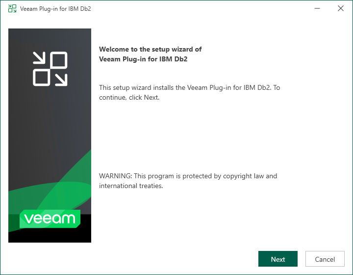
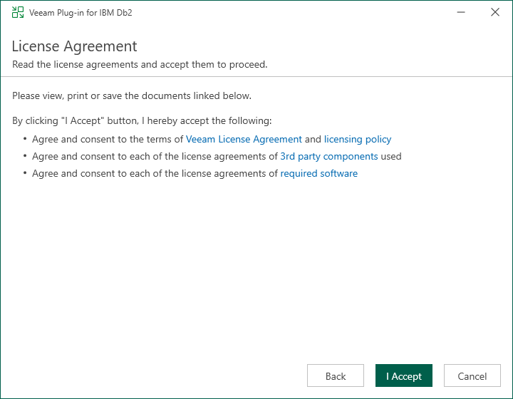
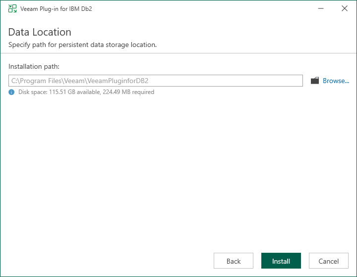
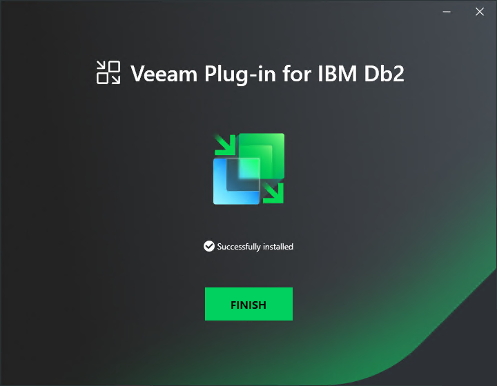

# Installing Plug-In on Microsoft Windows

Veeam Plug-In for IBM Db2 is an additional component of Veeam Backup & Replication. The installation package of the plug-in is included in the Veeam Backup & Replication installation ISO file and available for download from [veeam.com](https://www.veeam.com/products/data-platform-trial-download.html?tab=application-plugins).

You can install Veeam Plug-In for IBM Db2 on Windows machines using a wizard or in an unattended mode:

* [Installing Veeam Plug-In using an installation wizard](#win)
* [Installing Veeam Plug-In in an unattended mode](#unat)

Installing Plug-In Using an Installation Wizard

To install Veeam Plug-In for IBM Db2 on a Windows machine, perform the following steps:

1. Export installation packages to the machine with a database that you plan to protect. You can do it in the following ways:

Using the Veeam Backup & Replication installation image

1. Mount the Veeam Backup & Replication installation image.

You can download the latest version of the Veeam Backup & Replication installation image from [this Veeam webpage](https://www.veeam.com/products/data-platform-trial-download.html).

1. In the installation disk folder, go to \Plugins\IBM Db2\Windows.
2. Upload the VeeamPluginforDB2.exe file to the IBM Db2 machine, then run the uploaded file to launch the installation wizard.

Using veeam.com

1. Download the setup archive for Veeam Plug-In for IBM Db2 from [this Veeam webpage](https://www.veeam.com/products/data-platform-trial-download.html?tab=application-plugins).
2. Open the setup archive, in the \VeeamPluginforDB2-13.1.0.411\Windows folder, find the VeeamPluginforDB2.exe file.
3. Upload the VeeamPluginforDB2.exe file to the IBM Db2 machine, then run the uploaded file to launch the installation wizard.

1. Install Veeam Plug-In. To do this, run the following commands:

1. At the welcome screen of the installation wizard, click Next.

1. At the License Agreement step of the wizard, accept the terms of license agreements and click I Accept.

1. At the Data Location step of the wizard, specify the installation path for Veeam Plug-In and click Install.

1. Wait for the installation process to complete and click Finish to exit the wizard.

Once Veeam Plug-In is installed, you can configure the plug-in settings. For details, see [Configuring Plug-In on Microsoft Windows](db2_configure_win.md).

Installing Plug-In in Unattended Mode

To install Veeam Plug-In for IBM Db2 on a Windows machine in the unattended mode, do the following:

1. Export installation packages to the machine with a database that you plan to protect. You can do it in the following ways:

Using the Veeam Backup & Replication installation image

1. Mount the Veeam Backup & Replication installation image.

You can download the latest version of the Veeam Backup & Replication installation image from [this Veeam webpage](https://www.veeam.com/products/data-platform-trial-download.html).

1. In the installation image folder, go to \Plugins\IBM Db2\Windows.
2. Upload the VeeamPluginforDB2.exe file to the IBM Db2 machine.

Using veeam.com

1. Download the setup archive for Veeam Plug-In for IBM Db2 from [this Veeam webpage](https://www.veeam.com/products/data-platform-trial-download.html?tab=application-plugins).
2. Open the setup archive, in the \VeeamPluginforDB2-13.1.0.411\Windows folder, find the VeeamPluginforDB2.exe file.
3. Upload the VeeamPluginforDB2.exe file to the IBM Db2 machine.

1. Install Veeam Plug-In for IBM Db2 on a Windows machine in the unattended mode using the command line. Go to the folder where the VeeamPluginforDB2.exe file resides and run the following command:

|  |
| --- |
| <path\_to\_exe>\VeeamPluginforDB2.exe /silent /accepteula /acceptthirdpartylicenses /acceptlicensingpolicy /acceptrequiredsoftware |

where <path\_to\_exe> is the path to the Veeam Plug-In for IBM Db2 installation file.

Installing Plug-In in Unattended Mode

| Parameter | Description |
| /silent | Enables the silent mode. |
| /accepteula | Accepts [EULA](https://www.veeam.com/eula.html) terms. |
| /acceptthirdpartylicenses | Accepts terms of third-party licenses. |
| /acceptrequiredsoftware | Enables installation of the required software (Microsoft .NET Framework 4.6) and accepts terms of its license. |
| /acceptlicensingpolicy | Accepts terms of the Veeam licensing policy. |

Veeam Plug-In for IBM Db2 uses the following codes to report about the installation results:

* 1000 — Veeam Plug-In has been successfully installed.
* 1001 — prerequisite components required for Veeam Plug-In have been installed on the machine. Veeam Plug-In has not been installed. The machine needs to be rebooted.
* 1002 — Veeam Plug-In installation has failed.
* 1101 — Veeam Plug-In has been installed. The machine needs to be rebooted.

Once Veeam Plug-In is installed, you can configure the plug-in settings. For details, see [Configuring Plug-In on Microsoft Windows](db2_configure_win.md).

Page updated 2026-07-28

