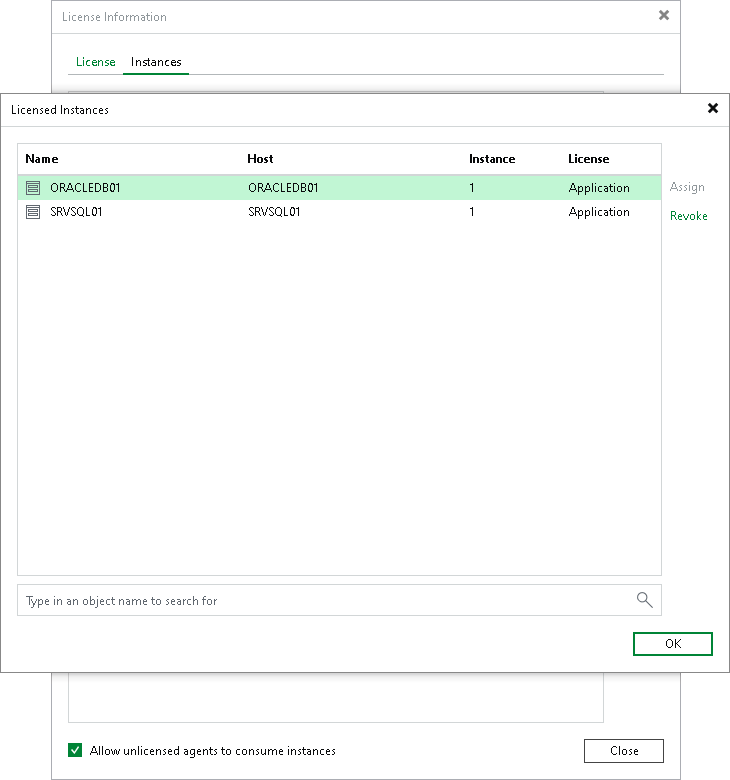

# Managing License

You can assign and revoke licenses for specific installed instances protected by Veeam Plug-Ins from the Veeam Backup & Replication server. This process helps you manage license usage and ensure only intended installed instances consume licenses.

Assigning License Use

To assign license usage to individual instances, do the following:

1. From the main menu, select License.
2. In the License Information window, click the Instances tab and click Manage.
3. In the Licensed Instances tab, select the installed instance and click Assign.
4. Click Close.

|  |
| --- |
| Note |
| Select the Allow unlicensed agents to consume instances check box to enable backup jobs. When this option is enabled, Veeam Backup & Replication renews agent licenses during each backup job run by removing and reassigning them. This renewal logic ensures that licenses are correctly updated when the license is renewed on the Veeam Backup & Replication server. |

Restricting License Use

To restrict instance consumption by all managed installed instances, do the following:

1. From the main menu, select License.
2. In the License Information window, click the Instances tab.
3. On the Instances tab, clear the Allow unlicensed agents to consume instances check box.
4. Click Close.

You can also restrict license consumption only for a specific installed Veeam Plug-In instance.

To restrict license consumption for specific installed instances, do the following:

1. From the main menu, select License.
2. In the License Information window, click the Instances tab and click Manage.
3. In the Licensed Instances tab, select the installed instance and click Revoke.
4. Click OK and then click Close to close the windows.

