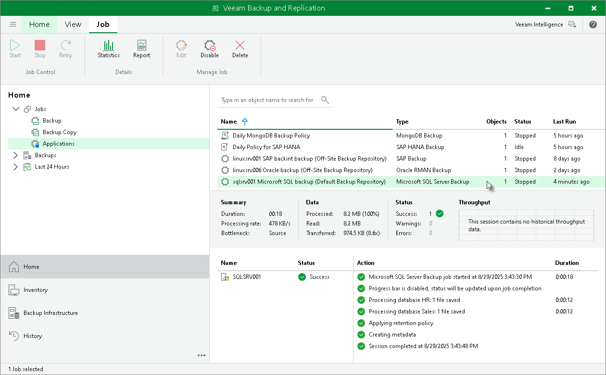

# Viewing Backup Job Statistics

To view details of the backup process, do the following:

1. Open the Veeam Backup & Replication console.
2. In the Home view, expand the Jobs node in the inventory pane and click Applications.
3. In the working area, select the application backup policy for Microsoft SQL Server to see details of the current backup process or the last backup job session.

|  |
| --- |
| Note |
| Veeam Backup & Replication does not display the progress bar for a running Veeam Plug-In for Microsoft SQL Server backup job. Statistics for backup jobs of this type becomes available after the backup job session is completed. |

