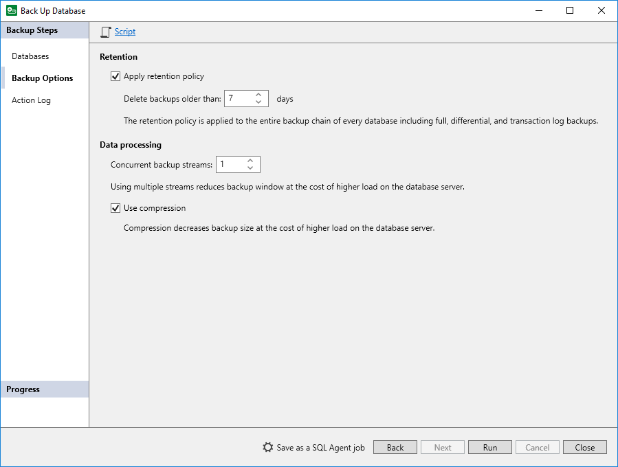

# Configuring Retention Policy

In this article

To configure the retention policy, select the Apply retention policy check box at the Backup Options step of the Back Up Database wizard and specify the number of days to keep restore points in the backup chain. For details, see [Specify Backup Options](backup_job_options.md).

In contrast to the retention policy for image-level backups in Veeam Backup & Replication, the retention policy for backups created with Veeam Plug-In is optional. This allows you to easier configure retention policy for different types of Microsoft SQL Server backups.

For example, you want to configure backup settings to create full, differential, log and copy-only full backups for the same database. In this case, you can enable retention policy in the backup settings for full backups only. Differential, log and copy-only full backups that depend on the full backup will be processed according to the retention policy specified for the full backup.

Alternatively, if you enable retention policy for multiple types of backups of the same database, you must specify the same number of days to keep restore points in the backup chain for each backup type supported by Veeam Plug-In. For the list of supported backups, see [Data Backup](data_backup_mssql_plugin.md). Otherwise, Veeam Plug-In will keep restore points according to the lowest number. For example, you set Veeam Plug-In to keep full backups for 7 days and copy-only full backups for 30 days. In this case, Veeam Plug-In will remove inactive backup chains whose restore points are older than 7 days during the next full backup session.

|  |
| --- |
| Note |
| If you do not specify the retention policy for any type of Microsoft SQL Server backup, Veeam Plug-In will not remove outdated restore points, and backup files fill remain in the backup repository. In this case, you can force delete backups using a dedicated command. For details, see [Configuring Force Deletion of Backups](plugins_mssql_retention_force.md).  Alternatively, you can manually delete Veeam Plug-In backups from a backup repository using the Veeam Backup & Replication console. For details, see: [Deleting Backup](delete_backups_mssql.md). |

Page updated 8/21/2025

Page content applies to build 13.0.1.1071
