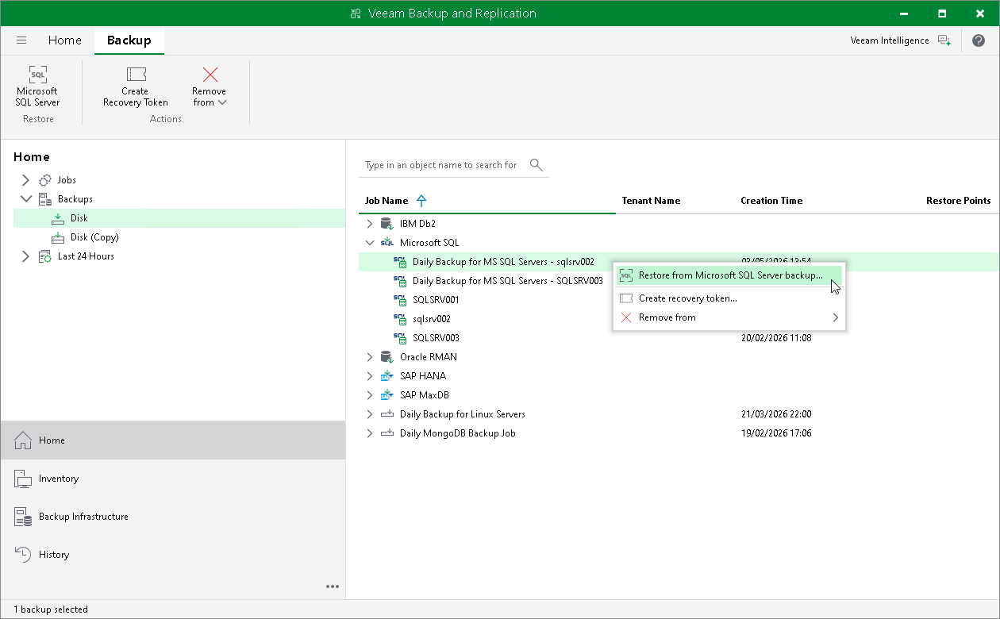

# Restoring from Microsoft SQL Server Backup

The Microsoft SQL Server backup restore option in Veeam Backup & Replication allows you to recover Microsoft SQL Server databases from backups. To restore Microsoft SQL Server databases Veeam Backup & Replication uses Veeam Explorer for Microsoft SQL Server.

To restore a database from a Microsoft SQL Server backup in Veeam Backup & Replication:

1. Open the Home view.
2. In the inventory pane, click Backups.
3. In the working area, right-click the backup and select Restore from Microsoft SQL Server backup.

Clicking the Restore from Microsoft SQL Server backup option starts Veeam Explorer for Microsoft SQL Server, which allows you to restore the required database. For detailed instructions on restoring databases with Veeam Explorer for Microsoft SQL Server, see [Restoring from SQL Plug-in Backups](vesql_restore_plugin.md).

For more information on restore procedures, see [Performing Restore](mssql_db_restore.md).

