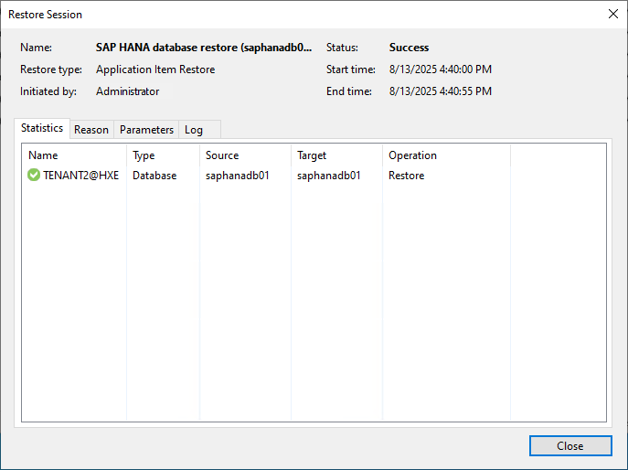
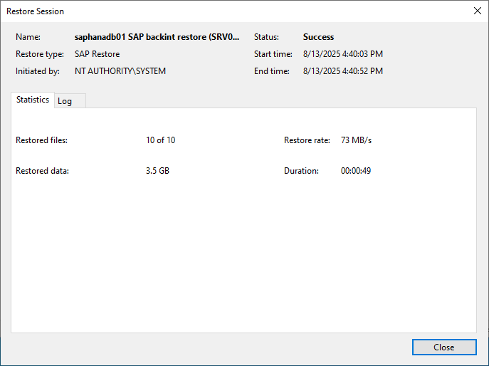

# Viewing Restore Session Statistics

You can view statistics for restore operations performed on application items or application plug-ins in Veeam Backup & Replication. The statistics window displays details such as session duration, restore operation type, list of restored files, and overall data size. For each restore session, you can view individual processing results and track progress for each database or system component, depending on the restore scope.

To view restore operations statistics, perform the following steps:

1. Open the History view.

|  |
| --- |
| Note |
| You can also view the restore operations statistics from the Home view, in the Last 24 Hours node. This method works only for restore operations completed within the past 24 hours. |

1. In the inventory pane, click the Restore node.
2. From the Restore node, you can choose a specific restore session statistic group:

* Application Item Restore - Includes statistics of restore operations of specific data objects from inside a database. The Statistics tab shows details such as the name, type and source of the restored item. The Reason tab shows any additional restore operation notes. The Parameter tab shows restore point details. The Log tab shows the restore operation processing progress.

* Application Plug-ins - Includes statistics of restore operations of entire databases from a backup using Veeam Plug-Ins. The Statistics tab shows details such as number of restored files, restored data size and restore operation duration. The Log tab shows the restore operation processing progress.

