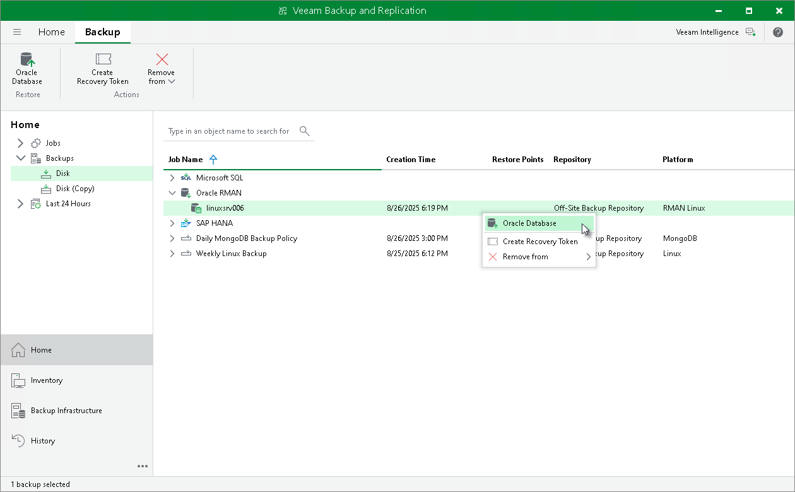
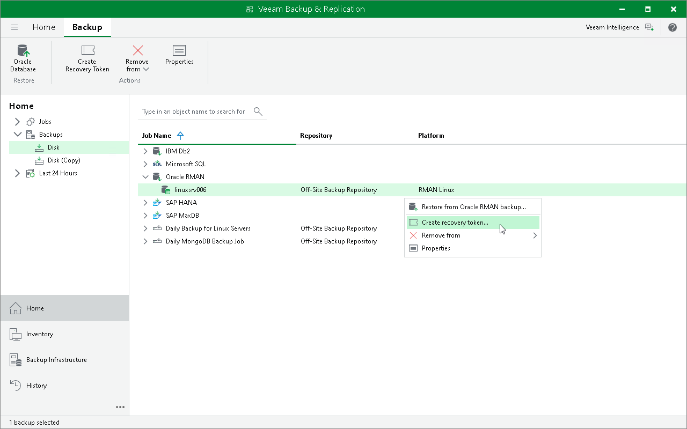
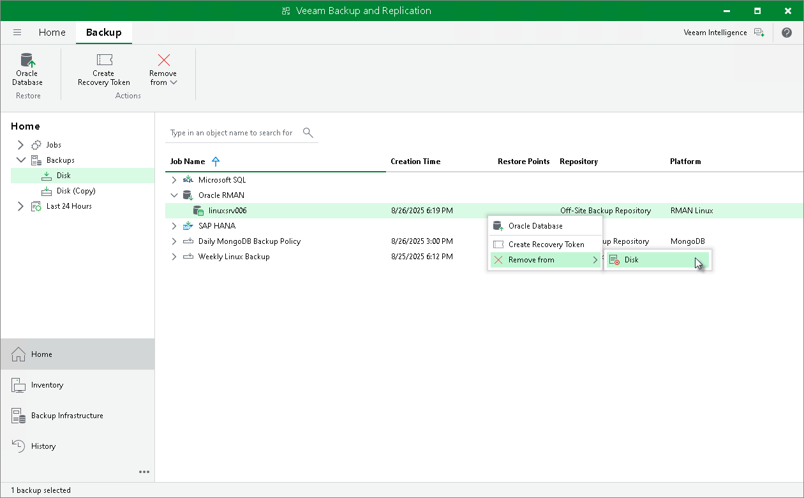
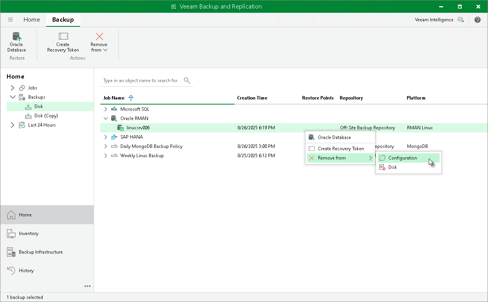
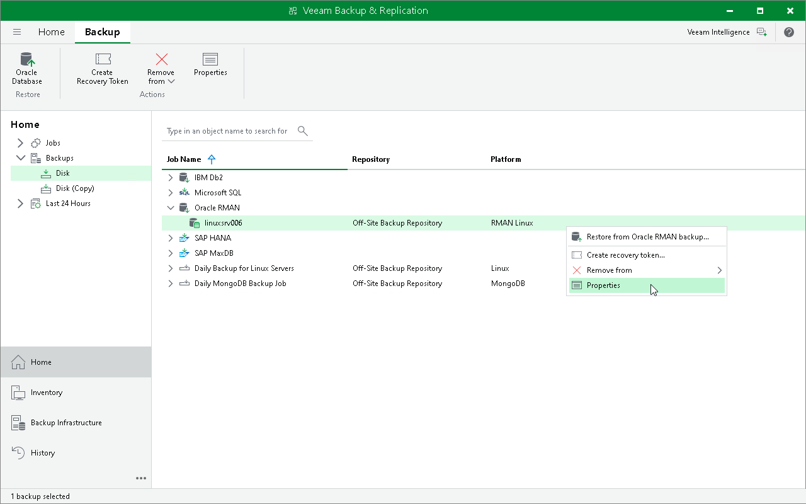

# Backup in Veeam Backup & Replication

|  |
| --- |
| Tip |
| If you want to manage backups created by Veeam Plug-In operating in the managed mode, see [Managing Application Backups](application_backups.md). |

After a backup job session completes successfully, Veeam Backup & Replication creates a backup in the backup repository. You can use the Veeam Backup & Replication console to restore using Veeam Explorer for Oracle, create recovery token, delete the backup, and view the backup properties.

Restoring with Veeam Explorer for Oracle

You can restore Oracle databases from Veeam Plug-In backups in the Veeam Backup & Replication console. To restore Oracle databases Veeam Backup & Replication uses Veeam Explorer for Oracle. For details, see [Restoring from RMAN Plug-in Backups](https://helpcenter.veeam.com/docs/vbr/userguide/rman_backups.html?ver=13).

|  |
| --- |
| Important |
| Consider the following limitations:   * Veeam Explorer for Oracle does not support restore of encrypted Oracle databases.  * Veeam Explorer for Oracle does not support restore of Oracle databases deployed on Solaris OS and IBM AIX. You can restore Oracle databases on Solaris OS and IBM AIX only with RMAN. For more information, see [Restore to Original Server](restore_rman.md). |

|  |
| --- |
| Tip |
| Consider the following:   * To perform restore from Oracle databases you can also use Veeam Explorer cmdlets. For details, see the [Veeam Explorer for Oracle](https://helpcenter.veeam.com/docs/vbr/explorers_powershell/veeam_explorer_for_oracle.html?ver=13) section of the Veeam Explorers PowerShell Reference. * For details on Veeam Explorer for Oracle, see [Restoring from RMAN Plug-in Backups](https://helpcenter.veeam.com/docs/vbr/userguide/rman_backups.html?ver=13). |

Creating Recovery Token

If you want to recover a database from a specific backup, you can use the Create recovery token operation.

You can generate a recovery token on the Veeam Backup & Replication side. Then, on the Oracle server side, use this token to get access to the backup and recover the database stored in it. To learn more about operations on the Oracle server side, see [Restore to Another Server](restore_other_server_rman.md#token).

Before creating a recovery token, consider the following prerequisites and limitations:

* Recovery tokens stay valid for 24 hours.
* You can recover data only from the backup for which the recovery token is generated.
* You can restore data from several backups in parallel.
* During recovery, Veeam Backup & Replication does not stop backup operations.
* You cannot create a recovery token for a whole backup copy job, but you can create a recovery token for individual objects included in a backup copy job.

To create a recovery token on the Veeam Backup & Replication side:

1. Open the Home view.
2. In the inventory pane, click Backups.
3. In the working area, right-click the backup and select Create recovery token.

You can create a recovery token for several backups. To do this, press and hold [Ctrl], select multiple backups, right-click one of the selected backups and select Create recovery token.

1. In the Create Recovery Token window, click Create.

|  |
| --- |
| Tip |
| Alternatively, you can create and modify the existing recovery token using the PowerShell console. To learn more, see the [Working with Tokens](https://helpcenter.veeam.com/docs/vbr/powershell/tokens.html?ver=13) section in the Veeam PowerShell Reference. |

Deleting Backups Manually

If you want to delete backups files, you can use the Oracle RMAN housekeeping functionality. For details, see [this Oracle article](https://docs.oracle.com/cd/E11882_01/backup.112/e10642/rcmmaint.htm#BRADV8172).

If you have lost the recovery catalog, you can remove the backups manually from a Veeam backup repository.

|  |
| --- |
| Important |
| If you remove backups from a Veeam backup repository manually, the metadata about these backups is NOT deleted from the recovery catalog. Thus, if you have a recovery catalog, it is not recommended to manually delete backup files. Otherwise, the recovery catalog will remain in the outdated state. |

To remove a backup from Veeam backups repository, do the following:

1. In the Veeam Backup & Replication console, open the Home view.
2. In the Inventory pane, select Backups.
3. In the working area, right-click the backup job object name and select Delete from disk.

Removing Backups from Configuration

If you want to remove records about backups from the Veeam Backup & Replication console and configuration database, you can use the Remove from configuration operation.

When you remove a backup from the configuration, backup files (.VAB, .VASM, .VACM) remain on the backup repository. You can import the backup later and restore data from it.

To remove a backup from configuration:

1. Open the Home view.
2. In the inventory pane, select Backups.
3. In the working area, select the necessary backup.
4. Press and hold the [Ctrl] key, right-click the backup and select Remove from configuration.

Viewing Backup Properties

To review what data Veeam Plug-In has backed up, check the backup properties in the Veeam Backup & Replication console.

To view backup properties:

1. Open the Home view.
2. In the inventory pane, expand the Backups node and select Disk. To view properties of backups stored on tape, select Tape.
3. In the working area, right-click the backup and select Properties.

The backup properties window displays the following information about the content of a backup file:

* Objects — databases backed up by Veeam Plug-In.
* Catalog Items — items created in the catalog for the backed-up databases.
* Files — backup files of a selected database that are stored in the backup repository.

To find a specific item in a list, use the search field. To copy the path to a backup file, use the Copy path button.

Page updated 2026-07-29

